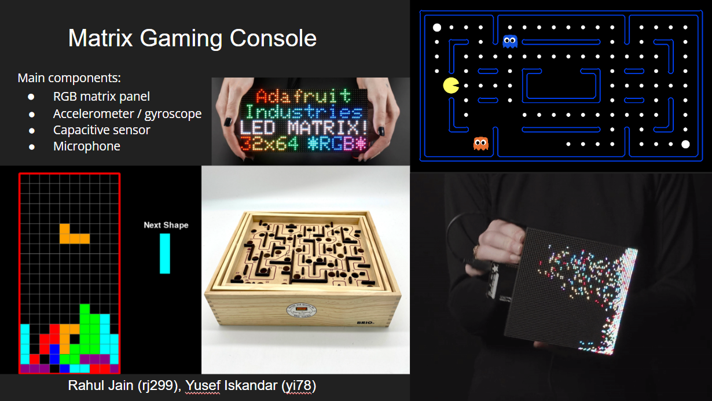

# Final Project: Matrix Gaming Console

**NAMES OF COLLABORATORS HERE** Rahul Jain, Yusef Iskandar

## Project Plan

### Project Big Idea

The idea is to create an interactive RGB matrix panel on which the user can play games. The difference from conventional games is that the angular movement of the matrix panel is detected by a gyroscope and displayed in the game. Additionally, capacitive sensors and a microphone will be used to allow the user to control special aspects of the game with touch or their voice. 

Potential games ideas:
* Pacman:
  * Gyroscope: Side to side tilt to move the player left to right
  * Capacitive sensors: press for activating features like 2x speed
  * Microphone: if the user is close to dying, they can yell (and press and hold the capacitive sensor) and activate a random teleport feature which moves them around the board; but it also reduces their score
* Maze:
  * Gyroscope: Side to side tilt to move the marble left to right
  * Capacitive sensors: reset and start from initial point
  * Microphone: Loud sound unlocks a hidden passage (moves walls around), but it reduces their score
* Tetris:
  * Gyroscope: Side to side tilt to move the pieces left to right
  * Capacitive sensors: Rotate orientation of pieces
  * Microphone: Loud sound unlocks a hidden passage (moves walls around), but it reduces their score
* Others: Snake, Brick Breaker, Etch-a-sketch

### Project Timeline

* WEEK 12: Concept Design
  * Brainstorming ideas and developing the interaction
  * Storyboarding + Verplank Diagrams
* WEEK 13: Physical Hardware Development
  * Nov 15: Ordered parts arrive
  * Testing functionality of individual components (Matrix panel, Gyroscope, Capacitive sensor, Microphone)
    * Gyroscope calibration
  * Soldering + Wiring components + Power
    * Solder gyroscope connection onto the matrix bonnet
    * Connect gyroscope / capacitive sensor over I2C bus
  * Create a cardboard + acrylic casing
    * Take measurements / account for spacing of components (including Pi, sensors, power cables)
    * Create holes for power cables / heat vent
* WEEK 14: Software Development
  * Test gyroscope, capacitive sensor interaction
  * Design home screen for the games + games themselves
  * Test with users
* WEEK 15 / 16:
  * Cleaning up code; documenting process

### Parts Needed

* Matrix Power supply 5V 4A - $15
  * https://www.mouser.com/ProductDetail/485-1466 
* Matrix Panel - $40
  * https://www.mouser.com/ProductDetail/485-2278 
* Matrix Bonnet - $15
  * https://www.mouser.com/ProductDetail/485-3211 
* Female DC Power Adapter - $2
  * https://www.mouser.com/ProductDetail/485-368 
* Gyroscope: MPU 6050 6 DoF - $13
  * https://www.mouser.com/ProductDetail/485-3886
* USB Microphone - $8
  * https://www.amazon.com/SunFounder-Microphone-Raspberry-Recognition-Software/dp/B01KLRBHGM 
* Raspberry Pi 3B+ - Have in the class kit
* StemmaQT Cables - Have in the class kit
* Capacitive Touch Sensor - Have in the class kit
* Raspberry Pi Power supply - Have in the class kit

### Risks / contingencies

One of the biggest risks for our idea is that the parts ordered turn out to be defective. Specifically, if any one of the matrix panels, matrix bonnet, or power supply turns out to be faulty, we will need to reorder parts which can take time. Another risk is that something unexpected arises when we try to make connections between the components. In general, our project plan is somewhat ambitious for the time frame as there are a lot of unknowns with both the hardware and software.

### Fall-back plan

One fall-back plan to mitigate the risk that the parts are defective is that we use any display we have and connect it with a HDMI cable to the raspberry pi. Another idea could be to use the gyroscope in an old mobile phone or a separate handheld controller (separate RPi) and stream the data to the display. To mitigate the risk of the unknowns in our project, we will focus on the core implementation first, which includes developing the main interaction components, before moving on to more complex things like creating better graphics / complex game logic.

