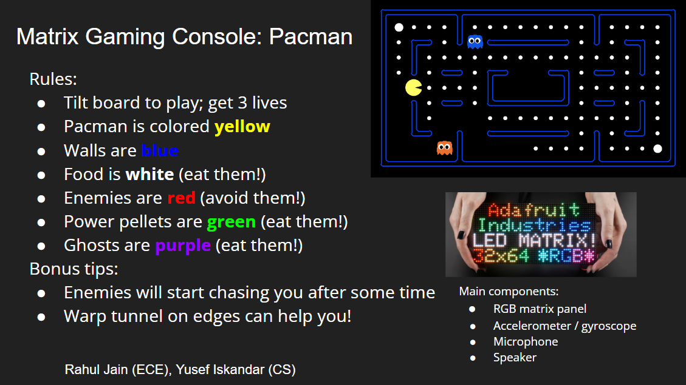
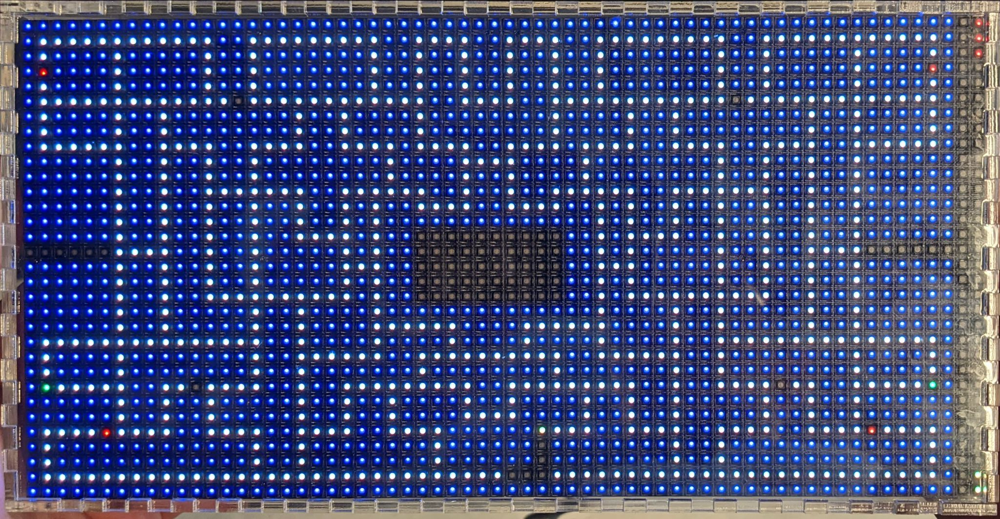

<a name="readme-top"></a>
<div align="center">
  <a href="https://github.com/jainr3/Interactive-Lab-Hub/tree/Fall2022/Final%20Project">
    
  </a>

<h3 align="center">Final Project - Matrix Gaming Console: Pacman</h3>

  <p align="center">
    An interactive version of the classic Pacman game
    <br />
    Rahul Jain, Yusef Iskandar
    <br />
    <a href="#demo"><strong>View Demo »</strong></a>
    <br />
    <br />
  </p>
</div>

---

<!-- TABLE OF CONTENTS -->
<details open>
  <summary>Table of Contents</summary>
  <ol>
    <li>
      <a href="#about-the-project">About The Project</a>
      <ul>
        <li><a href="#demo">Demo</a></li>
        <li><a href="#description">Description</a></li>
        <li><a href="#built-with">Built with</a></li>
        <ul>
          <li><a href="#ideation--concept-design">Ideation / Concept Design</a></li>
          <li><a href="#project-timeline">Project Timeline</a></li>
          <li><a href="#hardware-development">Hardware Development</a></li>
          <ul>
            <li><a href="#sensor-integration">Sensor Integration</a></li>
            <li><a href="#acryllic-case-design">Acryllic Case Design</a></li>
          </ul>
          <li><a href="#software-development">Software Development</a></li>
          <ul>
            <li><a href="#gyroscope-calibration">Gyroscope Calibration</a></li>
            <li><a href="#homescreen">Homescreen</a></li>
            <li><a href="#maze">Maze</a></li>
            <li><a href="#microphone-integration">Microphone Integration</a></li>
            <li><a href="#game-logic">Game Logic</a></li>
            <li><a href="#speaker-integration">Speaker Integration</a></li>
          </ul>
          <li><a href="#hardware-parts">Hardware Parts</a></li>
          <li><a href="#user-testing">User Testing</a></li>
          <li><a href="#list-of-interesting-bugs--special-behavior">List of interesting bugs / special behavior</a></li>
        </ul>
      </ul>
    </li>
    <li>
      <a href="#getting-started">Getting Started</a>
      <ul>
        <li><a href="#prerequisites">Prerequisites</a></li>
        <li><a href="#installation">Installation</a></li>
      </ul>
    </li>
    <li><a href="#license">License</a></li>
    <li><a href="#contact">Contact</a></li>
    <li><a href="#acknowledgments">Acknowledgments</a></li>
    <li><a href="#sources">Sources</a></li>
  </ol>
</details>


<!-- ABOUT THE PROJECT -->
# About The Project

<!-- DEMO -->
## Demo

The first video shows our product during Cornell Tech's Open Studio, where lots of people got the chance to try it. Our project was also featured on Cornell Tech's social media: [LinkedIn](https://www.linkedin.com/posts/cornell-tech_openstudio-studio-presentations-activity-7006371292236939265-g1_X?utm_source=share&utm_medium=member_desktop), [Instagram](https://www.instagram.com/p/Cl4d0hvOTAb/?hl=en), [Facebook](https://www.facebook.com/CornellTech/posts/517018370466412), [Twitter](https://twitter.com/cornell_tech/status/1600605655093608448) The second video demonstrates our implementation of Pacman on a matrix panel and the full functionality of the game.

<div align="center">
<a href="https://www.youtube.com/watch?v=YBvebi-GN_Y"></a>
<a href="https://www.youtube.com/watch?v=FJsH19XHq3g"></a>
</div>

<p align="right">[<a href="#readme-top">Top</a>]</p>

<!-- DESCRIPTION -->
## Description

Our project is a handheld matrix gaming console in which we have developed the game of Pacman from scratch. By tilting the board, the user can control the position of Pacman and eat food or ghosts to accumulate points. There's a catch though! The louder the environment the user is playing in, the more difficult the game. So put your skills to the test and play a game of Pacman!

<div align="center">

</div>

<p align="right">[<a href="#readme-top">Top</a>]</p>

<!-- BUILT WITH -->
## Built With

In the following section, we explain the steps we took to build the project. We started from the ideation phase and built up to designing, creating and testing our device. This includes the process of developing the hardware and software components.

### Ideation / Concept Design

The original idea was to create an interactive RGB matrix panel on which the user can play games. The difference from conventional games is that the angular movement of the matrix panel is detected by a gyroscope and displayed in the game. Additionally, a microphone will be used to allow the user to control special aspects of the game with their voice. We originally wanted to incorporate a capacitive sensor as well, but decided not to use it as it would complicate the interaction. The list of potential games that we wanted to implement are below - we chose Pacman. For reference the original README with the ideation / project plan is located [here](https://github.com/jainr3/Interactive-Lab-Hub/blob/Fall2022/Final%20Project/README_OLD.md).

Potential games ideas (original brainstorming):
* Pacman:
  * Gyroscope: Side to side tilt to move the player left to right
  * Capacitive sensors (removed): Press for activating features like 2x speed
  * Microphone: If the user is close to dying, they can yell (and press and hold the capacitive sensor) and activate a random teleport feature which moves them around the board; but it also reduces their score
* Maze:
  * Gyroscope: Side to side tilt to move the marble left to right
  * Capacitive sensors (removed): Reset and start from initial point
  * Microphone: Loud sound unlocks a hidden passage (moves walls around), but it reduces their score
* Tetris:
  * Gyroscope: Side to side tilt to move the pieces left to right
  * Capacitive sensors (removed): Rotate orientation of pieces
  * Microphone: Loud sound unlocks a hidden passage (moves walls around), but it reduces their score
* Others: Snake, Brick Breaker, Etch-a-sketch

Final Pacman Idea:
* Gyroscope: Side to side tilt to move the player left to right
* Microphone: Loud volume = faster game speed, Quieter volume = slower game speed; a faster game speed makes it harder to execute precise maneuvers around the walls
* Speaker: Special game states like pacman death, eating a ghost, game over have audio feedback to tell the user that they have occurred

The sketches and verplank diagrams are below.

<div align="center">


</div>

One of the biggest risks for our idea was that the parts ordered turn out to be defective. Specifically, if any one of the matrix panels, matrix bonnet, or power supply turns out to be faulty, we will need to reorder parts which can take time. Another risk was that something unexpected arises when we try to make connections between the components. In general, our project plan was somewhat ambitious for the time frame as there are a lot of unknowns with both the hardware and software, but our extensive research mitigated these risks.

One fall-back plan to mitigate the risk that the parts are defective is that we use any display we have and connect it with a HDMI cable to the raspberry pi. Another idea could be to use the gyroscope in an old mobile phone or a separate handheld controller (separate RPi) and stream the data to the display. To mitigate the risk of the unknowns in our project, we focused on the core implementation first, which includes developing the main interaction components, before we moved on to more complex things like creating better graphics / complex game logic.

<p align="right">[<a href="#readme-top">Top</a>]</p>

### Project Timeline

* WEEK 1: Concept Design
  * Brainstorming ideas and developing the interaction
  * Storyboarding + Verplank Diagrams
* WEEK 2: Physical Hardware Development
  * Nov 15: Ordered parts arrive
  * Testing functionality of individual components (Matrix panel, Gyroscope, Speaker, Microphone)
    * Gyroscope calibration
  * Soldering + Wiring components + Power
    * Solder gyroscope connection onto the matrix bonnet
    * Connect gyroscope over I2C bus
  * Create a cardboard + acrylic casing
    * Take measurements / account for spacing of components (including Pi, sensors, power cables)
    * Create holes for power cables / heat vent (if needed)
* WEEK 3: Software Development
  * Test gyroscope interaction
  * Design home screen for the game(s) + game(s) themselves
  * Test with users
* WEEKS 4 / 5:
  * Cleaning up code; documenting process

<p align="right">[<a href="#readme-top">Top</a>]</p>

<!-- HARDWARE DEVELOPMENT -->
### Hardware Development

<!-- SENSOR INTEGRATION -->
#### Sensor Integration

After the ordered parts arrived, we wired the matrix panel, its corresponding matrix bonnet and the Raspberry Pi together and ran simple software examples to see if the matrix panel was in proper working order.

<div align="center">

</div>

Since we wanted to use an accelerometer/gyroscope to sense the tilt of the matrix panel, we had to solder connectors for four pins (SDA, SCL, 5V, GND) on the back of the matrix bonnet. It was difficult to solder these four pins since they were right next to each other on the board, but we accomplished the feat with some tips and advice from the MakerLab super makers.

<div align="center">
 
</div>

We also used a USB microphone and plugged it into one of the Raspberry Pi's USB ports. The Raspberry Pi, sensors and speaker were placed into the back of an acryllic case that we created (more below). The image below shows the entire back of the case including Raspberry Pi, matrix panel,  matrix bonnet, microphone and accelerometer/gyroscope (speaker is missing from this image). 

<div align="center">

</div>

<p align="right">[<a href="#readme-top">Top</a>]</p>

<!-- ACRYLLIC CASE DESIGN -->
#### Acryllic Case Design

As a next step, we designed a permanent acryllic casing for the matrix panel. We generated our design by adjusting pre-defined parameters using [Festi](https://www.festi.info/boxes.py/). We used the Universal Box with parallel finger joint holes. The final box design can be seen in the following [file](./imgs/final_box_design.ai). We also had 4 other designs ([1](./imgs/box_design1.ai), [2](./imgs/box_design2.ai), [3](./imgs/box_design3.ai), [4](./imgs/box_design4.ai)) that we used to experiment with various parameters and features of the box. After generating a design, we printed a cardboard prototype to first verify that the sizing and other attributes were correct. We found some issues with the design related to the number of finger joints per side, the dimensions of the holes, and the actual dimensions of the case to ensure minimal play. After adjusting the design to fix these issues, we used the laser cutter to cut the final acrylic case.

<div align="center">
 

 
</div>

<p align="right">[<a href="#readme-top">Top</a>]</p>

### Software Development

#### Gyroscope Calibration

The most important piece of the software development was to ensure that we could accurately (and quickly) read values from our gyroscope. We also had to ensure that the gyroscope was calibrated properly and that we could calculate the right values that translate to real-world tilt. The two important angles that we calculated are "pitch" and "roll". To calculate these angles, we used the equations found below, which are derived from [here](https://ozzmaker.com/compass2/). 

<div align="center">

</div>

To test the functionality of the matrix panel, we taped a gyroscope to a box and ran a script using the equations described above. 

<div align="center">

</div>

After we found that the gyroscope worked and responded surprisingly well, we wrote some simple scripts to move a point on the matrix board by rotating the gyroscope. Here's a behind-the-scenes video showing some tests of the gyroscope readings and the progression of the Pacman's movement on the board.


<div align="center">
<a href="https://www.youtube.com/watch?v=jXzmlWeQkb0"></a>
</div>

<p align="right">[<a href="#readme-top">Top</a>]</p>

#### Homescreen

From the beginning of the project, we wanted our final product to be very intuitive to use and present in Open Studio. Therefore, we decided to design a home screen that will be displayed when the user sees our matrix panel and wants to start the game. The homescreen consists of a game tutorial on the left side. There, it explains that you need to tilt the matrix panel in the vertical and horizontal directions to move Pacman and that the user gets 3 lives. On the right side of the homescreen, the user sees a small calibration board where they can get used to Pacman's movement mechanics by tilting the board before starting the game. To start the game, the user must eat the four white dots that can be seen in the blue box at the bottom right of the home screen. You can see the homescreen in the image below. 

<div align="center">

</div>

<p align="right">[<a href="#readme-top">Top</a>]</p>

#### Maze

The next step was to create a maze based on the available pixel size of the matrix panel. The matrix panel is 64x32, but columns 63 and 64 were reserved for displaying the player's remaining lives and score. This means that our maze should be 62x32 in size. However, the classic map for Pacman only comes in the size of 28x31 so we had to create our own. We tried to use popular maze generation scripts like [Shaun LeBron's generator](https://shaunlebron.github.io/pacman-mazegen/) but modifying the existing code to suit our needs proved too difficult. Instead, we had to make our own board from scratch. Our first approach was to take a maze that was a different size, display it on the matrix board, and then see if we could scale it until it fit perfectly. An image of this board [#1](pacman_board_1.txt) can be seen below. 

<div align="center">

</div>

This ended up not being the best approach, so we had to manually design a maze with 62x32 shape and add in walls to narrow down the path for Pacman. This approach resulted in our final board [#2](pacman_board_2.txt). For the two boards described earlier, we assumed that Pacman gets food at every space that it can move into. Another approach was board [#3](pacman_board_3.txt), where we placed food at every other pixel. The intention with this board was to make the board less cluttered so that a player would not be overwhelmed by all the pixels being lit up at the same time. However, after some initial testing we determined that it was much too difficult for people to understand where the path that Pacman could follow was since there were too many gaps in where Pacman could move. We also generated boards [#4](pacman_board_4.txt) and [#5](pacman_board_5.txt) to easily test specific functionality of the game. For example, by having fewer dots on the board we could finish a level much quicker to test that logic. Additionally, we wanted to test what happens when a enemy tries to go through a tunnel so we "trapped" the enemy in the tunnel passageway so it kept walking back and forth between that spot.

<div align="center">

</div>

All Maze Files: [1](pacman_board_1.txt), [2](pacman_board_2.txt), [3](pacman_board_3.txt), [4](pacman_board_4.txt), [5](pacman_board_5.txt).

<p align="right">[<a href="#readme-top">Top</a>]</p>

#### Microphone Integration

Another unique feature of our Pacman game is that the speed of the game changes depending on the volume of the environment. This means that it is slightly easier for a silent player to avoid enemies since the volume level is lower. However, in a crowded setting like Open Studio, the player is quite literally "feeling the pressure" as a louder environment makes the game faster and more difficult. To detect the volume, we integrated a USB microphone into the Raspberry Pi. We started off using the [Lab 5 Microphone Code](https://github.com/jainr3/Interactive-Lab-Hub/blob/Fall2022/Lab%205/ExampleAudioFFT.py). Immediately, we observed that Pacman moved very slowly, taking about 1-2 seconds to "move" to another pixel even though we put the microphone code into a separate thread. This was because the main loop of our Pacman code relied on microphone readings and if it couldn't read the microphone fast enough that thread would be delayed as well. To make the existing code faster, we significantly increased the "frames per buffer", set the "update interval" to zero, and removed other irrelevant code related to things like frequency calculations. These changes significantly increased the speed at which Pacman moved and enabled smooth interaction with the game. (Imagine what it would have been like if it took 1-2 seconds to just move Pacman one square!)

<p align="right">[<a href="#readme-top">Top</a>]</p>

#### Game Logic

In our implementation of the game we tried to get as close as possible to the real Pacman game and then add a few twists. Each player has 3 lives and can earn points by eating food, where the user can get 10 points for food and 50 points for power pellets. After eating a power pellet, the game switches to ghost mode, where Pacman can eat ghosts. For each ghost eaten, the user gets 200 points. The game has four enemies that start at four different corners of the board. Although there are four enemies, not all of them are actively hunting Pacman and they are split between a "Scatter" and "Chase" mode depending on what phase of the level the user is in. In scatter mode, the enemies do not actively chase Pacman, but focus on a specific point on the matrix panel and move towards that position. Because they want to reach that position (set to the four corners of the maze), and the fact that they have to move "forwards", they end up moving in loops around that spot (see figure below).

<div align="center">

</div>

In addition to "Scatter" mode, the enemies have a "Chase" mode. As mentioned earlier, each enemy starts in "Scatter" mode, but after a certain amount of time the first enemy switches to "Chase" mode, then the second, until in the end all enemies are in "Chase" mode (with time delays between each). In "Chase" mode, the enemy is actively chasing Pacman's position (see figure below). Our algorithm simply takes the coordinates of the enemies potential next steps and the coordinates of the Pacman and calculates the Euclidean distances for each of those coordinates. The enemy then moves to the square the minimizes this distance. We also considered using Manhattan distance which (in contrast to Euclidean distance) calculates the number of grid squares between the two coordinates. Additionally, we tried to use Breadth First Search (BFS) which we thought would be the best solution. However, our implementation of this algorithm (as seen in our main file) might have a bug in it or it may simply take too much time since this could potentially be run 4x per game state iteration which is a lot. Therefore we decided to use the minimum Euclidean distance algorithm, which does its job amazingly well.

<div align="center">

</div>

Helpful resources we used for the game logic:
[1](https://gameinternals.com/understanding-pac-man-ghost-behavior),
[2](https://github.com/TechnoVisual/Pygame-Zero),
[3](https://pygame-zero.readthedocs.io/en/stable/#),
[4](https://github.com/szczys/matrixman)

<p align="right">[<a href="#readme-top">Top</a>]</p>

#### Speaker Integration 

As a last step of the whole final project we integrated a speaker into the system to play classic Pacman sound effects. We downloaded and used the intro music, the eating food, the eating power pellet, the eating ghost and the death sound effect from [here](https://www.classicgaming.cc/classics/pac-man/sounds). At first, we had a lot of problems using a speaker with the matrix panel at the same time. We considered using the Raspberry Pi's audio jack or USB speaker, but realized that matrix panel uses the [same hardware subystem to generate small pulses](https://github.com/hzeller/rpi-rgb-led-matrix/issues/158). Thus, we had to use a Bluetooth connection to a standard pair of headphones or a speaker. This proved to be difficult to setup as well and we had to experiment with a number of libraries. Finally, with the help of the BlueAlsa library and these [instructions](https://introt.github.io/docs/raspberrypi/bluealsa.html), we managed to get audio output. 

<p align="right">[<a href="#readme-top">Top</a>]</p>

### Hardware Parts

* Matrix Power supply 5V 4A - $15
  * https://www.mouser.com/ProductDetail/485-1466 
* Matrix Panel - $40
  * https://www.mouser.com/ProductDetail/485-2278 
* Matrix Bonnet - $15
  * https://www.mouser.com/ProductDetail/485-3211 
* Female DC Power Adapter - $2
  * https://www.mouser.com/ProductDetail/485-368 
* Gyroscope: MPU 6050 6 DoF - $13
  * https://www.mouser.com/ProductDetail/485-3886
* USB Microphone - $8
  * https://www.amazon.com/SunFounder-Microphone-Raspberry-Recognition-Software/dp/B01KLRBHGM 
* Raspberry Pi 3B+ - $35 (had in class kit)
  * https://www.mouser.com/ProductDetail/Adafruit/3775
* StemmaQT Cables - $1 (had in class kit)
  * https://www.mouser.com/ProductDetail/Adafruit/4399
* Raspberry Pi Power supply 5V 2.5A - $8 (had in class kit)
  * https://www.mouser.com/ProductDetail/Adafruit/1995
* Any Bluetooth Headset / Speaker

<p align="right">[<a href="#readme-top">Top</a>]</p>

### User Testing

Below is a video of user testing where users tested our project at our final project presentation day. We also presented our project during Cornell Tech's Open Studio, where many people got the chance to try our project. 

<div align="center">
<a href="https://www.youtube.com/watch?v=5i83VmwyNsk"></a>
</div>

One thing that we learned from our user testing is that our game is **hard**! However this was not unexpected since the actual game is hard even for the Pacman pros. Many of our users were able to clear about 25%-40% of the board which is great for the first try.

<p align="right">[<a href="#readme-top">Top</a>]</p>

### List of interesting bugs / special behavior

As we were working on the project, we ran into many interesting bugs that we had to special case in our implementation. A (non-exhaustive) list of these is located below (hopefully which are fixed).

* Observed the pacman walking through the ghost
* Bug when game is played, then player loses, game restarts but both homescreen and the game board are shown
* Ghost should not be able to use the tunnel
* When ghost turned into enemies, it spawned outside the map in the score columns
* Gyroscope has reading error sometimes (gimbal lock?)
* Pacman is stationary and ghost moves to its position - had to add collision check logic
* Eating a ghost should put the ghost in jail!
* Pacman eats ghost near wall, pacman pixel is colored in a wall; ghost does not go in jail
* 2nd+ life, eating a power pellet does nothing (solution: it didnt exist in the first place - visual bug!)
* Eat ghost increases score
* and much more...

<p align="right">[<a href="#readme-top">Top</a>]</p>

<!-- GETTING STARTED -->
# Getting Started

To get a local copy of the project, run the following simple steps.

## Prerequisites

Our project uses the rpi-rgb-led-matrix panel library which can be installed by following the steps [here](https://github.com/hzeller/rpi-rgb-led-matrix). The folder of this library is inside our project folder as well. 

<p align="right">[<a href="#readme-top">Top</a>]</p>

## Installation

The following steps show you how to run the project.

1. Clone the repo
   ```sh
   $ git clone https://github.com/jainr3/Interactive-Lab-Hub.git
   ```
2. Go into the correct directory
   ```sh
   $ cd "Final Project"
   ```
3. Install the project requirements
   ```sh
   $ pip install -r requirements.txt
   ```
4. Run the project by using following command
   ```sh
   $ sudo python3 pacman.py --led-cols=64 --led-gpio-mapping=adafruit-hat --led-slowdown-gpio=4 --led-brightness=30 --led-no-drop-privs
   ```

Note: If you are having problems running with these parameters, try adding other parameters like: `--led-no-hardware-pulse'.

Some of the other run commands that we used for various testing are below.

```sh
$ sudo python3 runtext.py --led-cols=64 --led-gpio-mapping=adafruit-hat --led-slowdown-gpio=4 --text="Pacman" --led-brightness=20

$ sudo python3 rotating-block-generator.py --led-cols=64 --led-gpio-mapping=adafruit-hat --led-slowdown-gpio=4 --led-brightness=20

$ sudo python3 pacman_test.py --led-cols=64 --led-gpio-mapping=adafruit-hat --led-slowdown-gpio=4 --led-brightness=20
```

The main code for the project is located in [pacman.py](pacman.py) which has dependencies in [pacman_sensors.py](pacman_sensors.py), [sample_base.py](samplebase.py) and a few other library files.

The initial testing files and other debugging files that we used are: [gyroscope_test.py](gyroscope_test.py), [led_panel_test.py](led_panel_test.py), [runtext.py](runtext.py), and [integration_test.py](integration_test.py).

<p align="right">[<a href="#readme-top">Top</a>]</p>

<!-- LICENSE -->
# License

Distributed under the MIT License. See `LICENSE.txt` for more information.

<p align="right">[<a href="#readme-top">Top</a>]</p>

<!-- CONTACT -->
# Contact

Rahul Jain - rj299@cornell.edu

Yusef Iskandar - yi78@cornell.edu

Project Link: [Matrix Gaming Console: Pacman](https://github.com/jainr3/Interactive-Lab-Hub/edit/Fall2022/Final%20Project/)

<p align="right">[<a href="#readme-top">Top</a>]</p>

<!-- ACKNOWLEDGMENTS -->
# Acknowledgments

We thank our professor Wendy Ju and the TA's Alexandra Bremer and Stacey Li for their amazing support throughout the entire project. Additionally, we would like to thank Niti Parikh and the Cornell Tech Maker Lab SuperMakers for their help and support throughout the project.

<p align="right">[<a href="#readme-top">Top</a>]</p>

<!-- SOURCES -->
# Sources

* https://www.festi.info/boxes.py/
* https://ozzmaker.com/compass2/
* https://gameinternals.com/understanding-pac-man-ghost-behavior
* https://github.com/TechnoVisual/Pygame-Zero
* https://github.com/AndrewSpittlemeister/Pathfinding-in-Pacman/blob/eaf1652424d5e6e888df95c9fd3a06e921dd52f5/pacfuncs.py#L176
* https://pygame-zero.readthedocs.io/en/stable/#
* https://github.com/szczys/matrixman
* https://shaunlebron.github.io/pacman-mazegen/
* https://www.classicgaming.cc/classics/pac-man/sounds
* https://github.com/hzeller/rpi-rgb-led-matrix/issues/158
* https://introt.github.io/docs/raspberrypi/bluealsa.html
* https://github.com/hzeller/rpi-rgb-led-matrix
* https://github.com/hzeller/rpi-rgb-led-matrix/issues/1170
* https://learn.adafruit.com/adafruit-rgb-matrix-plus-real-time-clock-hat-for-raspberry-pi/driving-matrices
* https://stackoverflow.com/questions/42693341/using-8khz-sample-rate-in-python-on-raspberry-pi3
* https://raspberrypi.stackexchange.com/questions/88641/real-time-sound-level-through-usb-audio-card
* https://github.com/hzeller/rpi-rgb-led-matrix/blob/master/bindings/python/rgbmatrix/core.pyx
* https://forums.raspberrypi.com/viewtopic.php?t=131216
* https://raspberrypi.stackexchange.com/questions/50109/bluetooth-device-list
* https://pimylifeup.com/raspberry-pi-bluetooth/
* https://github.com/Arkq/bluez-alsa/wiki/Using-BlueALSA-as-default-ALSA-PCM
* https://github.com/Arkq/bluez-alsa/issues/26
* https://hackaday.io/project/6036-1-pixel-pac-man
* https://learn.adafruit.com/rgb-led-matrix-cube-for-pi/field-notes
* https://learn.adafruit.com/mpu6050-6-dof-accelerometer-and-gyro/python-and-circuitpython
* https://learn.adafruit.com/rgb-led-matrix-cube-for-pi/rgb-matrix-bonnet-and-lis3dh-wiring
* https://learn.adafruit.com/adafruit-rgb-matrix-bonnet-for-raspberry-pi/driving-matrices
* https://learn.adafruit.com/32x16-32x32-rgb-led-matrix/powering
* https://learn.adafruit.com/32x16-32x32-rgb-led-matrix/connecting-using-rgb-matrix-shield
* https://github.com/hzeller/rpi-rgb-led-matrix
* https://learn.adafruit.com/32x16-32x32-rgb-led-matrix/new-wiring
* https://github.com/adafruit/Adafruit_CircuitPython_MPU6050
* https://github.com/adafruit/Adafruit_CircuitPython_MPU6050/blob/main/examples/mpu6050_inclinometer.py

<p align="right">[<a href="#readme-top">Top</a>]</p>
