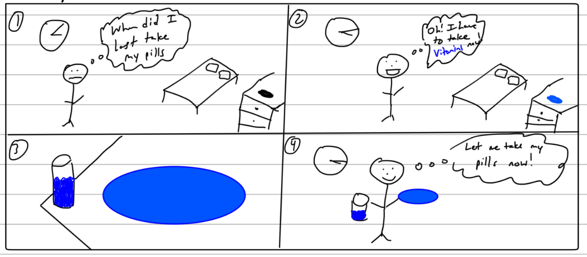
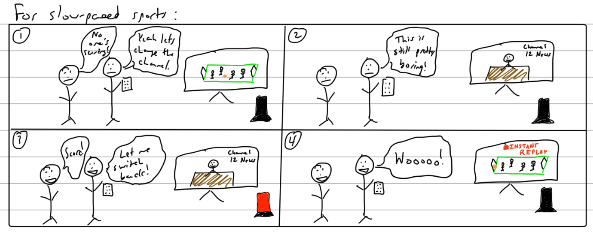
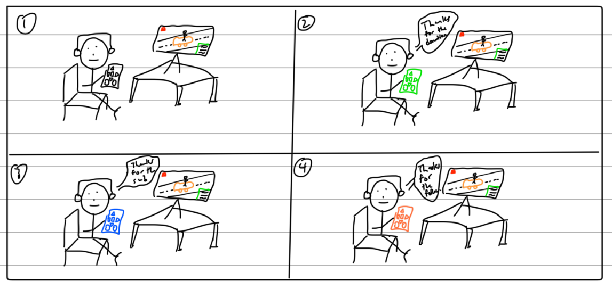
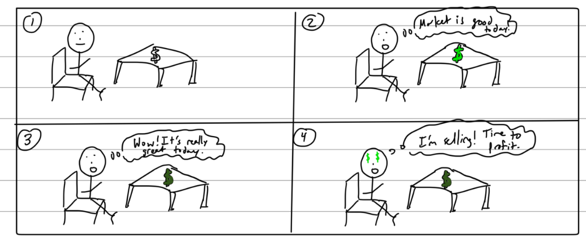
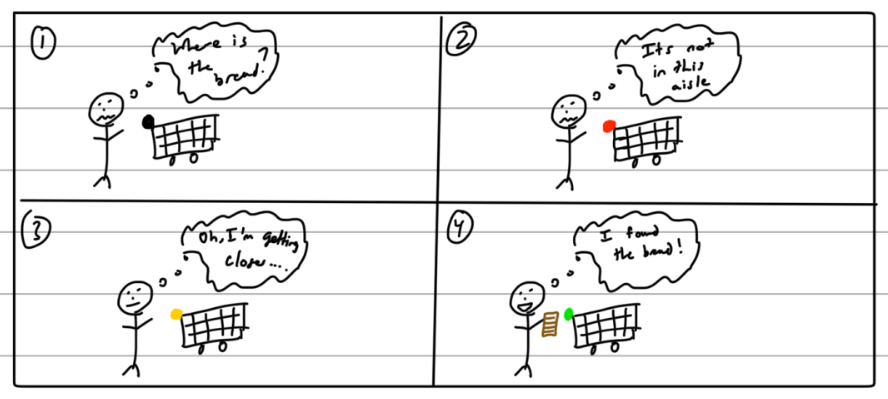
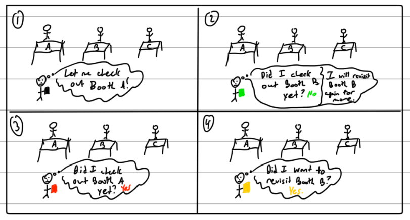
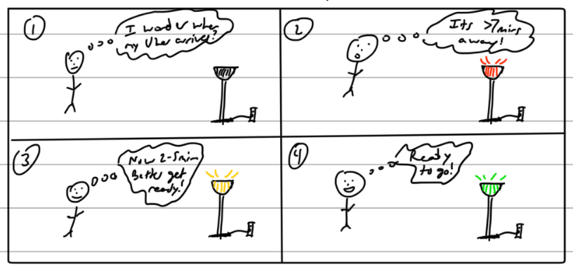
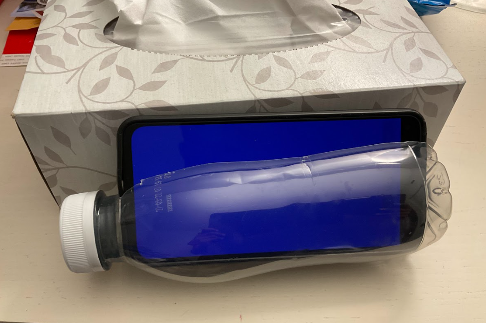
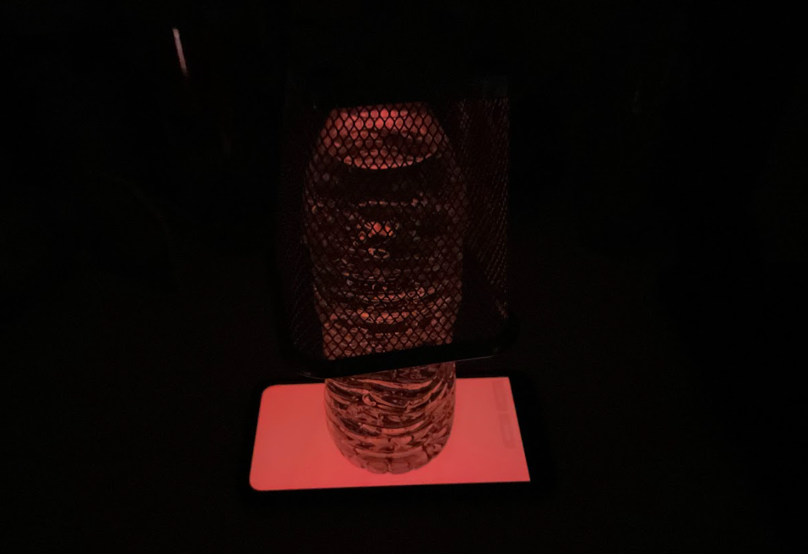
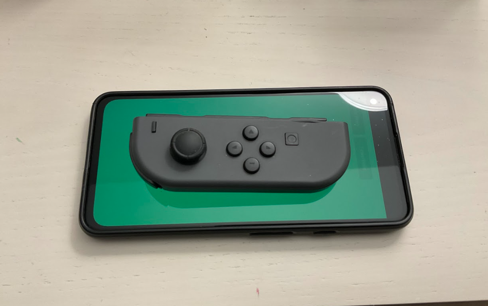

# Staging Interaction

In the original stage production of Peter Pan, Tinker Bell was represented by a darting light created by a small handheld mirror off-stage, reflecting a little circle of light from a powerful lamp. Tinkerbell communicates her presence through this light to the other characters. See more info [here](https://en.wikipedia.org/wiki/Tinker_Bell). 

There is no actor that plays Tinkerbell--her existence in the play comes from the interactions that the other characters have with her.

For lab this week, we draw on this and other inspirations from theatre to stage interactions with a device where the main mode of display/output for the interactive device you are designing is lighting. You will plot the interaction with a storyboard, and use your computer and a smartphone to experiment with what the interactions will look and feel like. 

### Deliverables for this lab are: 
1. 7 Storyboards
2. 3 Sketches/photos of costumed devices
3. Any reflections you have on the process
4. Video sketch of 3 prototyped interactions
5. Submit the items above in the lab1 folder of your class [Github page], either as links or uploaded files. Each group member should post their own copy of the work to their own Lab Hub, even if some of the work is the same from each person in the group.

For this lab, I have developed 7 different storyboard scenarios and then I chose my top 3 ideas. For these ideas, I created costumed devices and took a brief video for each.

## Lab Overview

A) [Plan](#part-a-plan) 

B) [Act out the interaction](#part-b-act-out-the-interaction) 

C) [Prototype the device](#part-c-prototype-the-device)

D) [Wizard the device](#part-d-wizard-the-device) 

E) [Costume the device](#part-e-costume-the-device)

F) [Record the interaction](#part-f-record)

## Part A. Plan 

\*\***Describe your setting, players, activity and goals here.**\*\*

**Idea #1: Smart Pillbox**
* Setting: The interaction is happening in my apartment on my dresser. Other locations like my bedside table or desk or in a hospital are possible as well.
* Players: Myself. This works for anyone in general and might especially be helpful for elderly people.
* Activity: The user will look at the pillbox-shaped device as an indication for when it is time to take medicines / vitamins. The smart pillbox will display a color to remind them of which pills to take. For example: Blue means take One A Day Vitamins and Orange means take Vitamin D.
* Goals: The user is aiming to take the correct medicines / vitamins on time.

**Idea #2: Sports Team Score Light (similar to the hockey goal light)**
* Setting: The interaction is happening in my living room with the television.
* Players: Myself. This works for anyone in general and might especially be good for sports fans.
* Activity: The user will look at the score light as an indication for when they should switch the channel back to the sports game. The light can light up different colors based on which sports channel the user should flip to (e.g. hockey = red)
* Goals: The user doesn't want to miss the scoring but also doesn't want to watch a lot of the sports game since it is slow-paced (e.g. hockey, soccer, baseball). Instead, they want to watch some other show and be alerted to whenever their team scores so they can flip the channel back and catch the replay. If the sport is a more fast-paced one, the light could be an indicator of whether the game is coming down to the wire (like at the end of a basketball game).

**Idea #3: Live-stream (Gaming) Donation / Subscriber / Following Indicator**
* Setting: The interaction is happening in my living room with the television. It could also take place at my desk.
* Players: Myself and people on the internet. This works for other types of live-streamers as well.
* Activity: The user will look at their controller which lights up when there is a new donation / subscriber / follower that they want to shout-out. The colors that could be used are donation = green, subscriber = blue, follower = orange.
* Goals: The goal is to indicate to the user that the donation / subscriber / follower has just come in so that they can give them a shout-out and thank them.

**Idea #4: Stock Price Tracker**
* Setting: The interaction is happening at my desk in my apartment.
* Players: Myself. This works for anyone who is interested in trading stocks.
* Activity: The user looks at a dollar sign toy with embedded LEDs and makes trading decisions based on the color. The dollar-sign toy will change colors on a gradient between red/yellow/green to indicate the performance of the stock. The darker the shade means the price difference is at a higher gain/loss %.
* Goals: The goal is to indicate to the user that it may be time to make a trading decision like selling shares. If the screen is dark red, it means that the stock is taking a big dip so it might be time to buy new shares or get rid of existing shares. Similarly, dark green indicates that it might be time to sell existing shares or get more shares if the user feels confident that the price will keep going up.

**Idea #5: Store Item Locator**
* Setting: The interaction is happening in a store (e.g. grocery store, department store).
* Players: Myself. This works great for people who are shopping in the store for the first time.
* Activity: The user walks around the store but doesn't know where to find a given item. The device which is mounted to a shopping cart will change colors on a gradient from blue (cold) to closer (yellow) to hot (red) based on the distance to the item.
* Goals: The goal is to help the user find the item in the store by themselves so they don't have to bother staff.

**Idea #6: Expo hall booth tracker**
* Setting: The interaction is happening in an expo hall / conference center.
* Players: The people attending the expo / conference.
* Activity: For each person, the light on their ID-card holder lights up red if they already visited a given booth or green if they have not yet visited the booth. Also, they can optionally mark booths that they want to revisit at a later time in the event (yellow color).
* Goals: As people walk around, they might forget which booths they already visited so the light will help them keep track so they can hit as many booths as possible.

**Idea #7: Uber/Lyft/Package/Food Delivery Indicator**
* Setting: The interaction is happening in my apartment's living room / common space.
* Players: Myself and/or my roommates.
* Activity: As the Uber/Lyft/Package/Food Delivery gets closer, the lamp bulb color changes on a gradient from red (7+ minutes) to yellow (2 to 7 minutes) to green (<2 minutes).
* Goals: The goal is to help the user be on time for the Uber/Lyft or pick up their package / food delivery on time.

\*\***Include pictures of your storyboards here**\*\*

**Storyboard #1: Smart Pillbox**

**Storyboard #2: Sports Team Score Light (similar to the hockey goal light)**

**Storyboard #3: Live-stream (Gaming) Donation / Subscriber / Following Indicator**

**Storyboard #4: Stock Price Tracker**

**Storyboard #5: Store Item Locator**

**Storyboard #6: Expo hall booth tracker**

**Storyboard #7: Uber/Lyft/Package/Food Delivery Indicator**

\*\***Summarize feedback you got here.**\*\*

**Idea #1: Smart Pillbox**

* Feedback: Relying on the user to remember which color equals what medicine might be hard so probably would be best to include some sort of text on the screen or a separate key somewhere that explains. Also, if multiple medicines are active, need to make sure we cycle through all of them and don't override the already active color.

**Idea #2: Sports Team Score Light (similar to the hockey goal light)**

* Feedback: The delay between the score light turning on and the channel switch would need to be minimal so they don't miss the instant replay.

**Idea #3: Live-stream (Gaming) Donation / Subscriber / Following Indicator**

* Feedback: Not sure if all gamers shout out their followers but smaller streamers probably do.

**Idea #4: Stock Price Tracker**

* Feedback: The different shades of the colors might be a little bit subjective but generally acceptable.

**Idea #5: Store Item Locator**

* Feedback: Like many of the other ideas, we would probably want to calibrate the thresholds for "close" and "far" to how the colors change over the gradient.

**Idea #6: Expo hall booth tracker**

* Feedback: This seems like a good idea, but might be tricky to actually implement.

**Idea #7: Uber/Lyft/Package/Food Delivery Indicator**

* Feedback: If there are multiple rooms in the apartment or house, might want to sync the lights across all of them or detect which room the person is in and only flash those lights.

## Part B. Act out the Interaction

For this part, I narrowed down my 7 ideas to the top 3.

\*\***Are there things that seemed better on paper than acted out?**\*\*

**Idea #1: Smart Pillbox**

* The smart pillbox seemed good on paper, but when I acted it out even I hesitated to accurately match up the color to the right medicine / vitamin.

**Idea #2: Sports Team Score Light (similar to the hockey goal light)**

* This idea was pretty much spot on. When the score light went off, switching the channel to watch the replay was good.

**Idea #3: Live-stream (Gaming) Donation / Subscriber / Following Indicator**

* This idea was also good. It might be a bit distracting if the gamer is trying to play the game and give people shout-outs but that would be the case for what they currently use which is that they just have to read the chat stream.

\*\***Are there new ideas that occur to you or your collaborators that come up from the acting?**\*\*

**Idea #1: Smart Pillbox**

* I did not have any new ideas for this one.

**Idea #2: Sports Team Score Light (similar to the hockey goal light)**

* An extension of this idea could be to make a warning light before your favorite TV show is about to come back on after a series of advertisements.

**Idea #3: Live-stream (Gaming) Donation / Subscriber / Following Indicator**

* I did not have any new ideas for this one.

## Part C. Prototype the device

\*\***Give us feedback on Tinkerbelle.**\*\*

* I thought the tool was very well made. I was able to use my phone as a stand-in for the 3 devices that I prototyped. Also if I want to make some minor modifications, I feel like I understand the tool and would be able to do so.

## Part D. Wizard the device

For this part, I narrowed down my 7 ideas to the top 3.

\*\***Include your first attempts at recording the set-up video here.**\*\*

For all of these scenarios, I used the tinkerbelle tool. My phone was used as "Tinkerbelle" and my laptop was used as "Jane Wren"

**Idea #1: Smart Pillbox**

* My first attempts for recording this one included me figuring out how to properly prop up the prototyped pill-box.

**Idea #2: Sports Team Score Light (similar to the hockey goal light)**

* My first attempt for recording this scenario included figuring out the best angle to film everything from and getting the lighting correct.

**Idea #3: Live-stream (Gaming) Donation / Subscriber / Following Indicator**

* My first attempt for recording this scenario included figuring out how to grip the makeshift device (gaming controller + phone).

\*\***Show the follow-up work here.**\*\*

**Idea #1: Smart Pillbox**

* The solution to prop up the pillbox with the phone was to simply rest it against another box.

**Idea #2: Sports Team Score Light (similar to the hockey goal light)**

* A side angle was used to capture myself and the television. Also, I closed the blinds to make the light a little bit more visible.

**Idea #3: Live-stream (Gaming) Donation / Subscriber / Following Indicator**

* I placed the controller ontop of the phone and gripped them both.

## Part E. Costume the device

\*\***Include sketches of what your devices might look like here.**\*\*

**Costume Photo #1: Smart Pillbox**

**Costume Photo #2: Sports Team Score Light (similar to the hockey goal light)**

**Costume Photo #3: Live-stream (Gaming) Donation / Subscriber / Following Indicator**

\*\***What concerns or opportunitities are influencing the way you've designed the device to look?**\*\*

**Idea #1: Smart Pillbox**

* The pillbox is meant to be shaped like a pill, but it was difficult to find something of this shape that was also transparent. I ended up using a Snapple bottle and cutting out a slot for the phone. There is definitely an opportunity here to make this device more presentable.

**Idea #2: Sports Team Score Light (similar to the hockey goal light)**

* The sports team score light is composed of a water bottle and mesh pencil holder. The light from the phone radiated through the water which illuminated the area around it. There is an opportunity to streamline this design by using a smaller bottle so the packaging becomes cleaner.

**Idea #3: Live-stream (Gaming) Donation / Subscriber / Following Indicator**

* The big concern for this device design was that the gaming controller and phone were not really connected to each other. There is an opportunity here to figure out how to integrate both of them.

## Part F. Record

\*\***Take a video of your prototyped interaction.**\*\*

**Video #1: Smart Pillbox**

**Video #2: Sports Team Score Light (similar to the hockey goal light)**

**Video #3: Live-stream (Gaming) Donation / Subscriber / Following Indicator**

\*\***Please indicate anyone you collaborated with on this Lab.**\*\*

* Patrick Mazza (ECE) helped me film my scenarios and also controlled the lights using the tinkerbelle tool. (I also helped him film and control the lights for his scenarios)
* The Sports Team Score Light (aka hockey goal light) was inspired from my experiences watching D1 College Hockey at my undergrad institution, Rensselaer Polytechnic Institute (RPI).

# Staging Interaction, Part 2 

This describes the second week's work for this lab activity.

## Prep (to be done before Lab on Wednesday)

You will be assigned three partners from another group. Go to their github pages, view their videos, and provide them with reactions, suggestions & feedback: explain to them what you saw happening in their video. Guess the scene and the goals of the character. Ask them about anything that wasn’t clear. 

\*\***Summarize feedback from your partners here.**\*\*

## Make it your own

Do last week’s assignment again, but this time: 
1) It doesn’t have to (just) use light, 
2) You can use any modality (e.g., vibration, sound) to prototype the behaviors! Again, be creative! Feel free to fork and modify the tinkerbell code! 
3) We will be grading with an emphasis on creativity. 

\*\***Document everything here. (Particularly, we would like to see the storyboard and video, although photos of the prototype are also great.)**\*\*
