# Interactive Prototyping: The Clock of Pi

Does it feel like time is moving strangely during this semester?

For our first Pi project, we will pay homage to the [timekeeping devices of old](https://en.wikipedia.org/wiki/History_of_timekeeping_devices) by making simple clocks.

It is worth spending a little time thinking about how you mark time, and what would be useful in a clock of your own design.

**Please indicate anyone you collaborated with on this Lab here.**

* I worked on this lab by myself, and I was inspired from a few different sources:
  * [The Billion Dollar Code Netflix Series](https://en.wikipedia.org/wiki/The_Billion_Dollar_Code)
  * [Nasa Mars Clock](https://www.giss.nasa.gov/tools/mars24/)
  * Main source for Earth images is the [die.net World Sunlight Map](https://www.die.net/earth/)
  * Many different sun clocks like these: [1](https://www.mathsisfun.com/sun-clock.html), [2](https://zoom.earth/), [3](https://www.nightearth.com/), [4](https://www.timeanddate.com/worldclock/sunearth.html?iso=20151222T1648&earth=1)

## Overview
For this assignment, you are going to 

A) [Connect to your Pi](#part-a)  

B) [Try out cli_clock.py](#part-b) 

C) [Set up your RGB display](#part-c)

D) [Try out clock_display_demo](#part-d) 

E) [Modify the code to make the display your own](#part-e)

F) [Make a short video of your modified barebones PiClock](#part-f)

G) [Sketch and brainstorm further interactions and features you would like for your clock for Part 2.](#part-g)

## Part A. 
### Connect to your Pi
I was able to connect to my Pi over SSH and setup a personal access token to push code from the Pi.

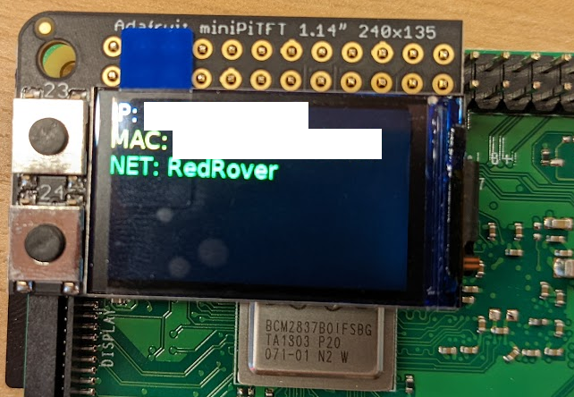

## Part B. 
### Try out the Command Line Clock
I was able to clone the lab-hub repo on the Pi and install the packages and then run the script which just printed out the current date / time.

## Part C. 
### Set up your RGB Display
I was able to successfully setup the RGB Display.

### Hardware (you have done this in the prep)
I was able to successfully connect the RGB Display to the Pi.

### Testing your Screen
The short video for the screen test is below:

#### Displaying Info with Texts
This test to display text on the screen with `stats.py` was successful.

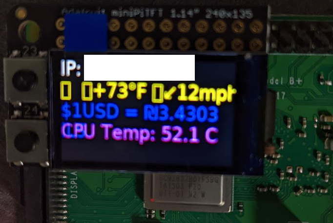

#### Displaying an image
I was able to use `image.py` to display the basic image and also use the code from the screen test to push a button and swap to another image.

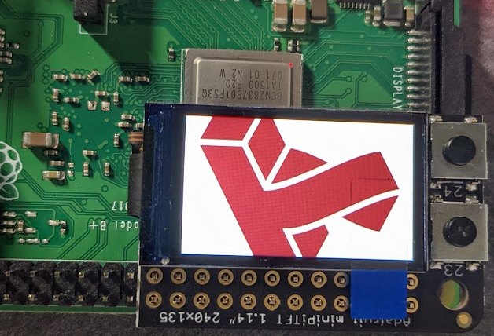

Video:

## Part D. 
### Set up the Display Clock Demo
I successfully edited `screen_clock.py` to show the time by filling in the while loop. I used the code in `cli_clock.py` and `stats.py` to generate a clock time and draw it in blue text on the screen.

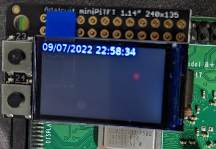

### How to Edit Scripts on Pi
I am familiar with using the nano editor to edit scripts on the Pi. However, I opted to use the [Visual Studio Code SSH Plugin](https://code.visualstudio.com/docs/remote/ssh) which lets me code in VS Code from my laptop while all the files are stored on the Pi. I can also open an integrated terminal in VS Code and run the scripts remotely.

## Part E.
### Modify the barebones clock to make it your own

Introducing the EarthClock. My clock measures time based on the sunlight over the earth. For example, the following pair of images shows the sunlight patterns at 10:30 AM and 11:30PM. The user can infer what time it is at their geographic location by looking at these images similar to the way a sundial operates (e.g. sun's rays = time).

**Sunlight Pattern at 10:30 AM**

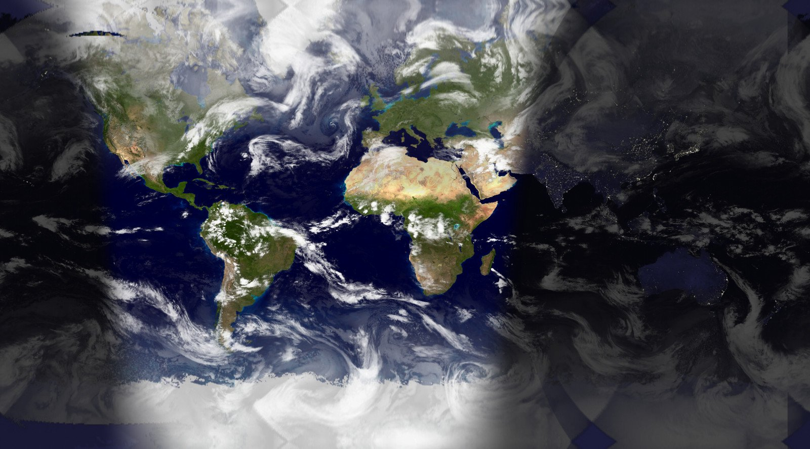

**Sunlight Pattern at 11:30 PM**

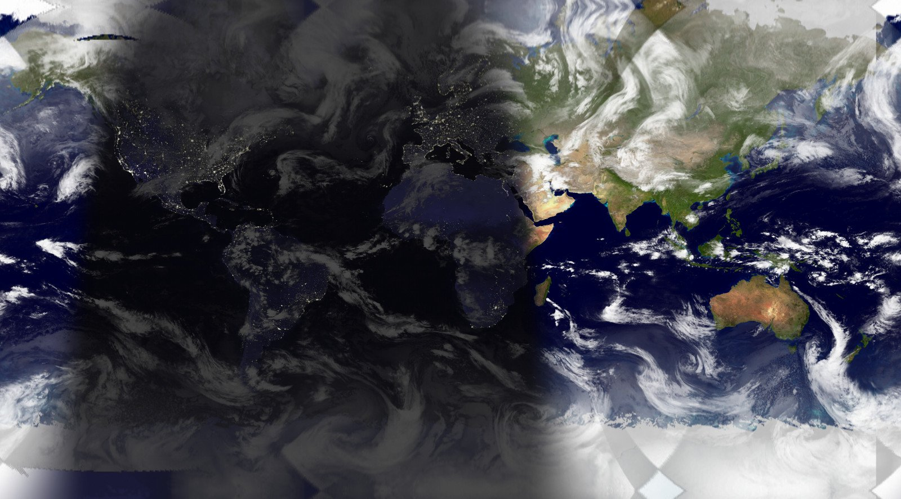

I created a Verplank diagram for my idea:

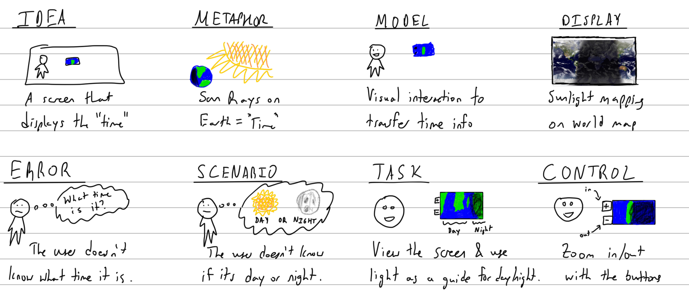

As noted in the diagram, the buttons can be used to zoom in and out on the earth image. The reason for doing this is that the screen size is too small to show any specific locations with an adequate amount of detail. This opens up my idea to further modifications which are described in Part G below. Overall, the zoom in / out feature allows users to see as much or as little detail for an approaching sunrise / sunset as well as how "far away" these times are.

\*\*\***A copy of your code should be in your Lab 2 Github repo.**\*\*\*

I had to do a few creative things to get the right earth images since it was especially challenging to find a live map API or service. I found a few websites that overlaid the sunlight shading onto the Earth but none of them offered an API that I could easily get the data or an image. Instead, I opted to use Chrome's chromedriver for python which basically allows me to open a webpage on the Raspberry Pi's webbrowser and take a screenshot. This was especially tricky since some pages take a variable amount of time to load the 3D model or image, but since I don't want to really update my image very often it was acceptable. Interestingly enough, I couldn't use wget or curl to retreive the image directly for the [die.net World Sunlight Map](https://www.die.net/earth/) since the website returned a 503 Service Unavailable code.

I first considered using [nightearth.com](https://www.nightearth.com/) which has a nice globe looking display, but I quickly realized that because of the 3D modeling, the Raspberry Pi could not handle loading the graphics consistently between zooming in / out the globe. Additionally, this website doesn't seem to "turn off" the lights from towns and cities during the day which makes the image a bit misleading. Instead, I opted to use the [die.net World Sunlight Map](https://www.die.net/earth/) which also has live data (every half hour) for the sunlight and also cloud coverage (updated daily) overlaid onto a Mercator projection of the Earth. Using this, I cropped the image and displayed it onto the LCD screen. Whenever the zoom in / zoom out button is pressed, I simply scale the cropped image (within some limits) and display that. I only fetch the image every 30 minutes since that is how often the website updates theirs. The full code is located in the `earth_clock.py` and the testing scripts that I used are `globe_clock_testing.py` and `earth_clock_testing.py`.

The globe image from [nightearth.com](https://www.nightearth.com/) that I didn't end up using (and how it looked on the screen):

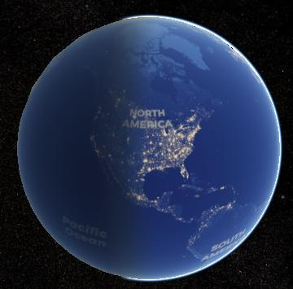
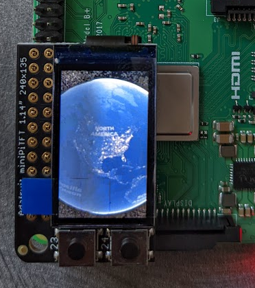

The Mercator projection from [die.net World Sunlight Map](https://www.die.net/earth/) (and the cropped version that gets displayed):

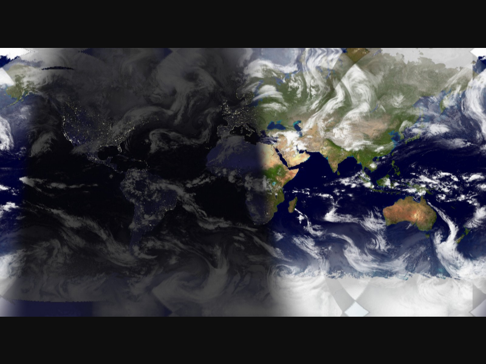

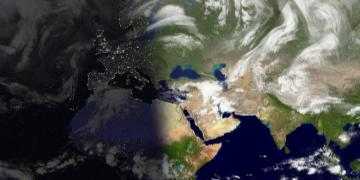

The documentation that I referenced to create these scripts are listed below:

* https://stackoverflow.com/a/52572919
* https://sites.google.com/a/chromium.org/chromedriver/getting-started
* https://ivanderevianko.com/2020/01/selenium-chromedriver-for-raspberrypi
* https://www.pythonanywhere.com/forums/topic/28261/
* https://stackoverflow.com/questions/64717302/deprecationwarning-executable-path-has-been-deprecated-selenium-python
* https://stackoverflow.com/questions/70886717/chromedriver-for-linux32-does-not-exist-python-selenium-chromedriver
* https://pillow.readthedocs.io/en/stable/deprecations.html
* https://selenium-python.readthedocs.io/locating-elements.html
* https://stackoverflow.com/questions/72773206/selenium-python-attributeerror-webdriver-object-has-no-attribute-find-el

## Part F. 
## Make a short video of your modified barebones PiClock

\*\*\***Take a video of your PiClock.**\*\*\*

Video of the Zoom Out feature

Video of the Zoom In feature

## Part G. 
## Sketch and brainstorm further interactions and features you would like for your clock for Part 2.
Another function that might be desired by the user is the ability to pan around the image to see different parts of the Earth. This could be very useful if they don't know whether their friend on the other side of the world is awake or not. To control this, the user could use a joystick to move the image around the screen.

Also, depending on the exact technical implementation, I could overlay some text to show the digital time or possibly the timezone for the location currently shown. This could be useful so the user doesn't have to "eyeball" the time (although the main purpose of this clock is to indicate day / night at a high level and whether it is close to sunrise / sunset). To implement this, I would have to figure out the coordinates on the static map and then convert that to the time / timezone, which might be very difficult!

Another idea could be to somehow incorporate the globe view if a different button is pressed. Although the zoom in / out for that view seems out of reach for the lab, it would be interesting to test whether I could rotate the globe and show that to the user.

# Prep for Part 2

1. Pick up remaining parts for kit on Thursday lab class. Check the updated [parts list inventory](partslist.md) and let the TA know if there is any part missing.
  

2. Look at and give feedback on the Part G. for at least 2 other people in the class (and get 2 people to comment on your Part G!)

# Lab 2 Part 2

Pull Interactive Lab Hub updates to your repo.

Modify the code from last week's lab to make a new visual interface for your new clock. You may [extend the Pi](Extending%20the%20Pi.md) by adding sensors or buttons, but this is not required.

As always, make sure you document contributions and ideas from others explicitly in your writeup.

You are permitted (but not required) to work in groups and share a turn in; you are expected to make equal contribution on any group work you do, and N people's group project should look like N times the work of a single person's lab. What each person did should be explicitly documented. Make sure the page for the group turn in is linked to your Interactive Lab Hub page. 

