# Chatterboxes
**NAMES OF COLLABORATORS HERE** Rahul Jain

In this lab, we want you to design interaction with a speech-enabled device--something that listens and talks to you. This device can do anything *but* control lights (since we already did that in Lab 1).  First, we want you first to storyboard what you imagine the conversational interaction to be like. Then, you will use wizarding techniques to elicit examples of what people might say, ask, or respond.  We then want you to use the examples collected from at least two other people to inform the redesign of the device.

We will focus on **audio** as the main modality for interaction to start; these general techniques can be extended to **video**, **haptics** or other interactive mechanisms in the second part of the Lab.

## Prep for Part 1: Get the Latest Content and Pick up Additional Parts 

### Pick up Web Camera If You Don't Have One

I have [this webcam](https://www.amazon.com/Microphone-Streaming-Compatible-Conferencing-Recording/dp/B09JZ8P8ZT).

### Get the Latest Content

I have pulled the latest content.

## Part 1.

### Text to Speech 

I ran each of the scripts and observed the speaker output differnt words at different pitches / tones / voices.

\*\***Write your own shell file to use your favorite of these TTS engines to have your Pi greet you by name.**\*\*

I had to give my shell script [executable permissions](https://www.cyberciti.biz/faq/how-to-execute-a-shell-script-in-linux/) and then was able to run the [script](./part1_tts.sh). My favorite was the Google TTS engine which was actually able to pronounce my name correctly!

### Speech to Text

This example was particularly difficult to get working. The key is to have a quieter environment.

\*\***Write your own shell file that verbally asks for a numerical based input (such as a phone number, zipcode, number of pets, etc) and records the answer the respondent provides.**\*\*

I wrote a [short script](./part1_stt.sh) and [short python file](./part1_stt.py) that acts as a verbal calculator. First, the Pi will ask for numbers 0 to 9 to add together, then the user speaks and the sound is collected and processed. Once the numbers are identified, the numbers are added together and outputted to the console.

### Serving Pages

Yes I was able to run the Hello World example. The output webpage is below:

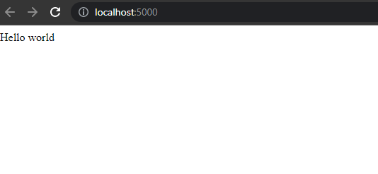

### Storyboard

\*\***Post your storyboard and diagram here.**\*\*

I created a Smart Elevator that users can interact with using their voice. The different interactions that I considered include: changing the elevator music, controlling the floor numbers, and interacting with the elevator to solve riddles as a conversation starter. Because the time in an elevator is somewhat brief, the interaction scenarios are not generally long. Thus, I have considered these 3 different scenarios and provided storyboards, verplank diagrams, and dialogues for them.

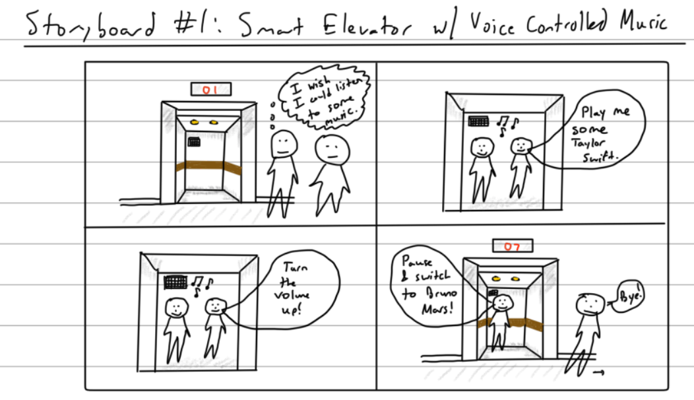

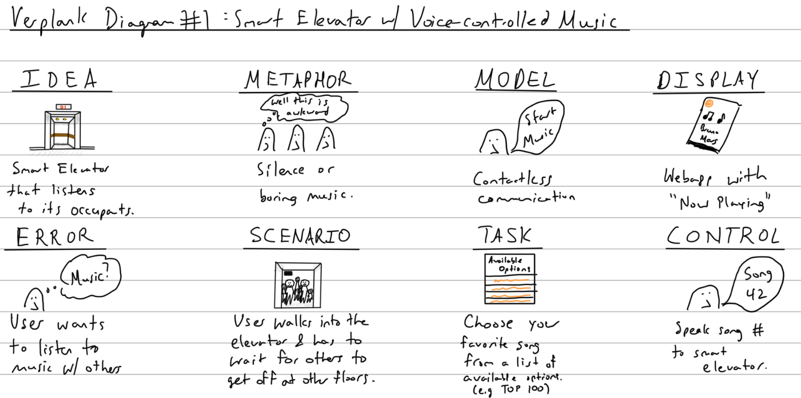

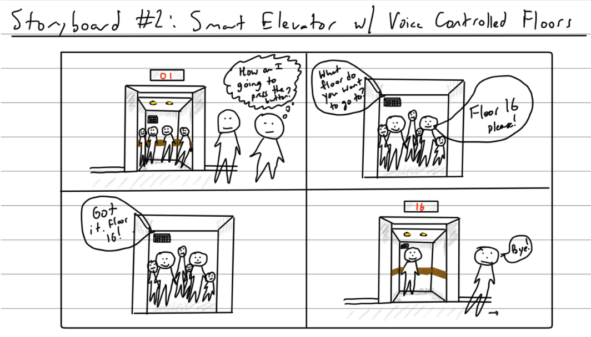

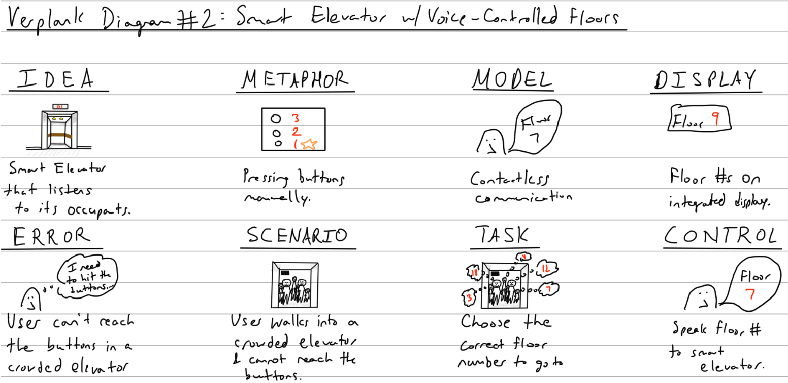

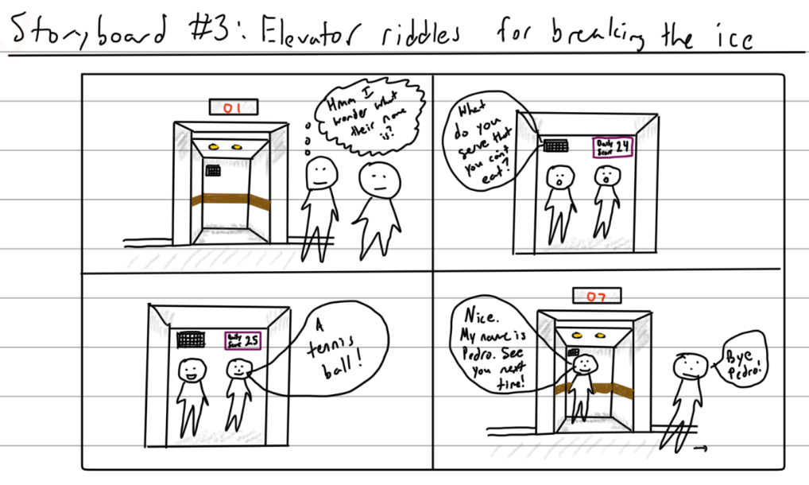

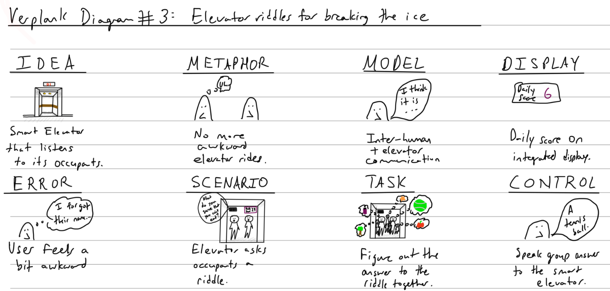

\*\***Please describe and document your process.**\*\*

While I was thinking about scenarios for interaction in a SmartElevator, I considered what common activities in the elevator would be and arrived at: changing the elevator music, controlling the floor numbers, and talking with other people in the elevator. I also decided to start the interactions with the trigger word of "Ok Ele" so that the elevator was not *always* listening (privacy issues!). Also for crowded elevators, users would have to speak one at a time so the elevator could understand the user. Some of the benefits of voice commands in an elevator include contactless interaction (germ free!) and being good for crowded elevators so people don't have to shuffle around. Some of the other related ideas that I considered were having the elevator read the time out loud when asked, a "berserk mode" where all the buttons get pressed so users have to stop on every floor, and a 20 questions or jokes telling type game.

#### **Scenario 1**

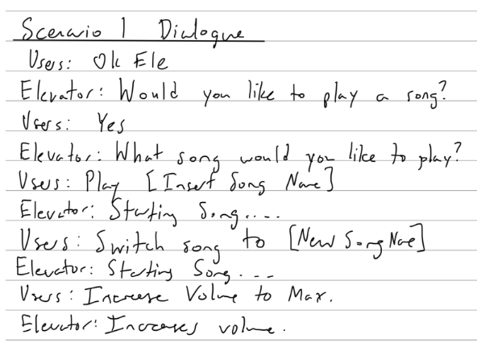

#### **Scenario 2**

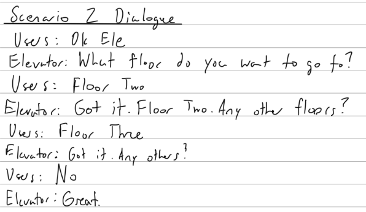

#### **Scenario 3**

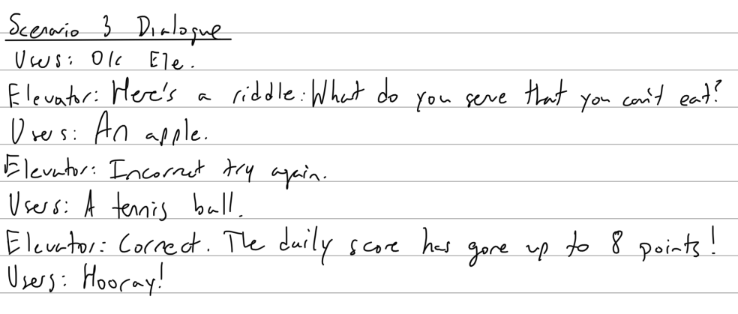

### Acting out the dialogue

\*\***Describe if the dialogue seemed different than what you imagined when it was acted out, and how.**\*\*

#### **Scenario 1**

One thing that I didn't consider was if the user gave the trigger word and the command at the same time. Although this would minimize the interaction, it seems like it would be technically difficult to actually implement since the top-of-the-line voice assistant type devices on the market struggle with this too. Also, in practice it might be easier to have my implementation of the speech to text service (which has to be offline since the interaction is in an elevator where the WiFi is bad) use song numbers rather than song names since the numbers are easier to search for.

#### **Scenario 2**

One thing that I didn't consider was the usefulness of this idea when the elevator has a small number of floors available. In elevators with ~5 floors, it would be less useful than elevators with ~25 floors since there would be more overlaps on average. Also, if people are hurrying into the elevator and say something immediately after the last person, the speech to text service might have trouble distinguishing the floor number.

#### **Scenario 3**

One thing that I didn't consider was what would happen if the user's didn't get the riddle right. The humorous guess from the users that I talked with was that the elevator would refuse to let them out until they got the riddle correct. At the moment, my system would just not award them points and the daily score would not be incremented. Instead of a riddle, I might want to consider using a joke or icebreaker question to properly break the ice between people in the elevator.

### Wizarding with the Pi (optional)

\*\***Describe if the dialogue seemed different than what you imagined, or when acted out, when it was wizarded, and how.**\*\*

I ran a wizarding test with the demo code and was able to stream sensor data from the pi. This part was optional, but I will consider using an accelerometer or other sensor for something in the next part of the lab. One idea is to change the volume of the music or play/pause music based on the acceleration of the elevator. Also, I could use a [gesture sensor](https://www.adafruit.com/product/3595) to detect if the user wants to go up or down inside the elevator. Another sensor that might be interesting to use is a [distance sensor](https://www.adafruit.com/product/3595).

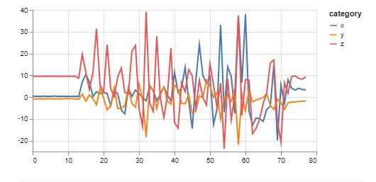

# Lab 3 Part 2

For Part 2, you will redesign the interaction with the speech-enabled device using the data collected, as well as feedback from part 1.

## Prep for Part 2

1. What are concrete things that could use improvement in the design of your device? For example: wording, timing, anticipation of misunderstandings...
2. What are other modes of interaction _beyond speech_ that you might also use to clarify how to interact?
3. Make a new storyboard, diagram and/or script based on these reflections.

## Prototype your system

The system should:
* use the Raspberry Pi 
* use one or more sensors
* require participants to speak to it. 

*Document how the system works*

*Include videos or screencaptures of both the system and the controller.*

## Test the system
Try to get at least two people to interact with your system. (Ideally, you would inform them that there is a wizard _after_ the interaction, but we recognize that can be hard.)

Answer the following:

### What worked well about the system and what didn't?
\*\**your answer here*\*\*

### What worked well about the controller and what didn't?

\*\**your answer here*\*\*

### What lessons can you take away from the WoZ interactions for designing a more autonomous version of the system?

\*\**your answer here*\*\*

### How could you use your system to create a dataset of interaction? What other sensing modalities would make sense to capture?

\*\**your answer here*\*\*

