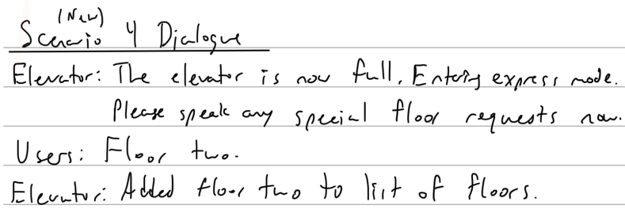

# Chatterboxes
**NAMES OF COLLABORATORS HERE** Rahul Jain

In this lab, we want you to design interaction with a speech-enabled device--something that listens and talks to you. This device can do anything *but* control lights (since we already did that in Lab 1).  First, we want you first to storyboard what you imagine the conversational interaction to be like. Then, you will use wizarding techniques to elicit examples of what people might say, ask, or respond.  We then want you to use the examples collected from at least two other people to inform the redesign of the device.

We will focus on **audio** as the main modality for interaction to start; these general techniques can be extended to **video**, **haptics** or other interactive mechanisms in the second part of the Lab.

## Prep for Part 1: Get the Latest Content and Pick up Additional Parts 

### Pick up Web Camera If You Don't Have One

I have [this webcam](https://www.amazon.com/Microphone-Streaming-Compatible-Conferencing-Recording/dp/B09JZ8P8ZT).

### Get the Latest Content

I have pulled the latest content.

## Part 1.

### Text to Speech 

I ran each of the scripts and observed the speaker output differnt words at different pitches / tones / voices.

\*\***Write your own shell file to use your favorite of these TTS engines to have your Pi greet you by name.**\*\*

I had to give my shell script [executable permissions](https://www.cyberciti.biz/faq/how-to-execute-a-shell-script-in-linux/) and then was able to run the [script](./part1_tts.sh). My favorite was the Google TTS engine which was actually able to pronounce my name correctly!

### Speech to Text

This example was particularly difficult to get working. The key is to have a quieter environment.

\*\***Write your own shell file that verbally asks for a numerical based input (such as a phone number, zipcode, number of pets, etc) and records the answer the respondent provides.**\*\*

I wrote a [short script](./part1_stt.sh) and [short python file](./part1_stt.py) that acts as a verbal calculator. First, the Pi will ask for numbers 0 to 9 to add together, then the user speaks and the sound is collected and processed. Once the numbers are identified, the numbers are added together and outputted to the console.

### Serving Pages

Yes I was able to run the Hello World example. The output webpage is below:

### Storyboard

\*\***Post your storyboard and diagram here.**\*\*

I created a Smart Elevator that users can interact with using their voice. The different interactions that I considered include: changing the elevator music, controlling the floor numbers, and interacting with the elevator to solve riddles as a conversation starter. Because the time in an elevator is somewhat brief, the interaction scenarios are not generally long. Thus, I have considered these 3 different scenarios and provided storyboards, verplank diagrams, and dialogues for them.

\*\***Please describe and document your process.**\*\*

While I was thinking about scenarios for interaction in a SmartElevator, I considered what common activities in the elevator would be and arrived at: changing the elevator music, controlling the floor numbers, and talking with other people in the elevator. I also decided to start the interactions with the trigger word of "Ok Ele" so that the elevator was not *always* listening (privacy issues!). Also for crowded elevators, users would have to speak one at a time so the elevator could understand the user. Some of the benefits of voice commands in an elevator include contactless interaction (germ free!) and being good for crowded elevators so people don't have to shuffle around. Some of the other related ideas that I considered were having the elevator read the time out loud when asked, a "berserk mode" where all the buttons get pressed so users have to stop on every floor, and a 20 questions or jokes telling type game.

#### **Scenario 1**

#### **Scenario 2**

#### **Scenario 3**

### Acting out the dialogue

\*\***Describe if the dialogue seemed different than what you imagined when it was acted out, and how.**\*\*

#### **Scenario 1**

One thing that I didn't consider was if the user gave the trigger word and the command at the same time. Although this would minimize the interaction, it seems like it would be technically difficult to actually implement since the top-of-the-line voice assistant type devices on the market struggle with this too. Also, in practice it might be easier to have my implementation of the speech to text service (which has to be offline since the interaction is in an elevator where the WiFi is bad) use song numbers rather than song names since the numbers are easier to search for.

#### **Scenario 2**

One thing that I didn't consider was the usefulness of this idea when the elevator has a small number of floors available. In elevators with ~5 floors, it would be less useful than elevators with ~25 floors since there would be more overlaps on average. Also, if people are hurrying into the elevator and say something immediately after the last person, the speech to text service might have trouble distinguishing the floor number.

#### **Scenario 3**

One thing that I didn't consider was what would happen if the user's didn't get the riddle right. The humorous guess from the users that I talked with was that the elevator would refuse to let them out until they got the riddle correct. At the moment, my system would just not award them points and the daily score would not be incremented. Instead of a riddle, I might want to consider using a joke or icebreaker question to properly break the ice between people in the elevator.

### Wizarding with the Pi (optional)

\*\***Describe if the dialogue seemed different than what you imagined, or when acted out, when it was wizarded, and how.**\*\*

I ran a wizarding test with the demo code and was able to stream sensor data from the pi. This part was optional, but I will consider using an accelerometer or other sensor for something in the next part of the lab. One idea is to change the volume of the music or play/pause music based on the acceleration of the elevator. Also, I could use a [gesture sensor](https://www.adafruit.com/product/3595) to detect if the user wants to go up or down inside the elevator. Another sensor that might be interesting to use is a [distance sensor](https://www.adafruit.com/product/3595).

# Lab 3 Part 2

For Part 2, you will redesign the interaction with the speech-enabled device using the data collected, as well as feedback from part 1.

## Prep for Part 2

I created a Smart Elevator that users can interact with using their voice, gesture, and presence. The different interactions that I considered include: changing the elevator music, controlling the floor numbers, having the elevator tell jokes, and having the elevator enter an "express" mode when the elevator is full. Because the time in an elevator is somewhat brief, the interaction scenarios are not generally long but may occur one after the other. Thus, I have considered these 4 different scenarios and provided storyboards, verplank diagrams, and dialogues for them.

1. What are concrete things that could use improvement in the design of your device? For example: wording, timing, anticipation of misunderstandings...

* Timing: Training the users to not speak over each other. (Practice)
* Timing: Training the users to not give trigger word + command at the same time. (Practice)
* Wording: Having the users use song numbers instead of song names. (Use preset songs of the day)
* Wording: Having the elevator give clear & succinct commands. (Refining the wording)
* Misunderstandings: Possibly ave the elevator give a default response when there is a misunderstanding or just don't take any action (Catch all case)

2. What are other modes of interaction _beyond speech_ that you might also use to clarify how to interact?

The primary way to clarify how to interact is to convert some of the dialog to other forms of interaction that are clearer and more natural to use. These other forms may also make it so there is a lower chance of misunderstandings and also so that timing is less of an issue.

* Gestures via Gesture Sensor: 
  * Up / down direction for the elevator
  * Increase / decrease the volume of the music
* Distance via Distance Sensor:
  * Pause / Play the music based on hovering at a very close distance
* Visual cues via a LCD Display:
  * Now playing song number
  * Floor numbers
  * Last thing that the elevator spoke (like subtitles for people who are hearing-impaired but can speak)
* Presence via Person Counter:
  * Is the elevator full? Then don't stop at any more floors.

3. Make a new storyboard, diagram and/or script based on these reflections.
* Please see the following section for the storyboard, diagram, and scripts.

**Brainstorming and considering ideas / designs**

I continued to think about common scenarios for interaction in a SmartElevator which include changing the elevator music, controlling the floor numbers, talking with other people, and being in a full elevator. I also looked at [all the different types of elevators](https://en.wikipedia.org/wiki/Elevator) that exist and seeing what they can be used for. I decided to keep the trigger word of "Ok Ele" and use the camera to detect presence since timing is very important for the interaction. I don't want the elevator to not be able to deliver the punchline for the jokes / riddles scenario if the user gets off at an earlier floor. Also for crowded elevators, users would have to speak one at a time so the elevator could understand the user. Some of the benefits of voice commands in an elevator include contactless interaction (germ free!) and being good for crowded elevators so people don't have to shuffle around. 

Some of the other related ideas that I considered include the following:
* Telling jokes or proposing ice breaker questions in the elevator
* Play song of the day
* Full elevators mean that the elevator should not stop at any more floors
  * Can automatically sense this based on the person counter script or approximate by counting the number of floors pressed (going up) or how many floors you stopped at on the same trip (going down)
  * Special users can say specific things to skip intermediate floors (eg management, VIPs)
  * Management can override at peak usage times
* App to tell users what floor the elevator is on
  * Note: Might have to open a local WiFi network to stream data locally since the Pi might not be able to connect to the internet inside the elevator
* Limiting the number of stops or just passively counting the number of stops throughout the day
* Making emergency calls (Fireman service)
* Surprise me mode / Berserk mode
* 20 Questions game
* Reading the time out loud

**Revised / new storyboards, verplank diagrams, and dialogues**

## Prototype your system

The system should:
* use the Raspberry Pi - Yes I have used the Pi.
* use one or more sensors - Yes I have used the Gesture sensor and the Camera.
* require participants to speak to it - Yes, Participants will speak with it.

*Document how the system works*

**Communication of the Idea**

The interaction starts off with a user entering the elevator and saying "ok ele" to wake the elevator. Then the elevator will ask how it can help the user, to which the user may reply "Play music", "Select floor", or "Tell me a joke". If the user selects music, the elevator will read off the 3 songs of the day and ask the user to select the desired song *number*. If the user selects floor, the elevator will ask for floor number on repeat (to collect all the floor numbers) until all the users have been exhausted and then it will confirm all the floors. If the user selects tell me a joke, the elevator will read off a randomized joke and then wait a few seconds and give the answer. This process continues on while the elevator is working. Additionally, the smart elevator will detect if there are a lot of people in the elevator and if so it will enter an "express-mode" and not stop at intermediate floors unless requested. Please see the following two sections for the technical accomplishments and the testing videos for each of the scenarios.

**Technical Accomplishments & Details**

* I used a different speech to text library in python called [SpeechRecognition (PocketSphinx)](https://github.com/Uberi/speech_recognition) instead of the original STT library. I found this one to be much more accurate with detecting words. I was also able to develop the "trigger word" or "wake word" behavior that is found in most commercially available voice assistant devices. It was not detecting the phrase "ele" so I just changed it to "alley" or "ok alley" since it sounds similar. Once the trigger word was heard, the program would wake up and ask users for additional input. From that point, the different scenarios could be run depending on what the user selected using follow up commands.

* I was able to connect the gesture sensor to the RaspberryPi and use that for increasing or decreasing the volume of the music that was playing. I also made a simple version for the summon elevator feature which basically is equivalent to pressing the up or down buttons on a real system.\

* For the music scenario, I downloaded a few preset clips to use as the "daily songs of the day". For the floor selection scenario, I used the gesture sensor. For the jokes scenario, I used [Google's jokes](https://github.com/15Dkatz/official_joke_api/blob/master/jokes/index.json).

* I was able to run the given default people detection script and modify it so that when a certain number of people are detected, the elevator enters express mode and only stops at specially requested floors. This script uses the USB Camera to detect the number of people and starts the dialogue after presence is detected. I decided not to integrate this scenario with the first three since the logic would have been very complicated and confusing. An image from my early test is below.\

* In general, I was able to use a number of different libraries for the implementation of the smart elevator. These include libraries for Speech to Text, the gesture sensor, and the audio mixer to play/pause/resume/stop music when desired.

* The final script for the 3-in-1 interaction is [here](./part_2/part2.py) and the 4th interaction is [here](./part_2/scenario4/express_mode.py). These scripts actually run fully autonomously and are **not** scripted in any way beyond the general structure.

**Behind-the-scenes videos**
Please see the following videos for a **behind-the-scenes** look at how each scenario works. These tests were conducted in a highly controlled environment where there was minimal sound and echo so the STT engine could process my words properly (and *autonomously*!). Please note that none of these interactions are scripted beyond the general structure as I am not controlling what the program hears or speaks back to me.

### Scenario 1 (Music) Behind-the-scenes

### Scenario 2 (Floors) Behind-the-scenes

### Scenario 3 (Jokes) Behind-the-scenes

### Scenario 4 (Express-mode) Behind-the-scenes

Note that for testing purposes, I set the threshold to just 1 person to just see if the logic flowed.

*Include videos or screencaptures of both the system and the controller.*

The following videos show the tests with real users. These interactions were a bit more scripted since it is very hard to have the Python speech to text library interpret the words reliably. Also, since elevators don't have good internet connection I was not able to SSH into the Pi and run the scripted version of the script so I had to use a button to start the interaction and then use timers between user replies and elevator responses.

### Scenario 1 (Music) Acting

For this one, I had to shoot it right outside the elevator because the internet connection was not stable.

### Scenario 2 (Floors) Acting

### Scenario 3 (Jokes) Acting

### Scenario 4 (Express-mode) Acting

## Test the system

Please see the above video for tests with the users.

### What worked well about the system and what didn't?

When it was able to hear the user's voice, it was pretty good at detecting what word they were saying. The problem is that for almost all the time, it would need to be very quiet in the elevator for the user to be heard. Additionally, the use of the wake word "ele" or "ok ele" (which is short for elevator) made it easy to start the interaction since timing is critical. Unfortunately, due to the limitations of the STT library that I used, the processing time for my words was a bit longer than I would have liked since it creates time for an awkward pause. I also thought that my use of the word "alley" as a dictionary substitution for "ele" was clever. 

### What worked well about the controller and what didn't?

Choosing among the scenarios and then the automatic follow up questions based on the different scenarios worked really well. The gesture sensor worked quite well for controlling the volume of the music that was playing and I was able to increase and decrease it. The feature for summoning the elevator to go up/down (contactless!) was a bit awkward since the gesture sensor would have to be placed *outside* the elevator which would make it a bit hard to physically connect it to the other parts of the system *inside* the elevator.

### What lessons can you take away from the WoZ interactions for designing a more autonomous version of the system?

Although I have intertwined the three scenarios, it is hard to technically implement a system where it could automatically swap between them. For example, if the music is currently playing but a user wants to select a floor, they would have to first pause the music and then select the floor (if they want verbal confirmation that the floor is selected). Right now, my program does let them select the floor but is unable to give them the verbal confirmation since music is playing already. Another big lesson is the importance of timing; since these interactions in elevators are brief, the processing time needs to be quick for the TTS and SST portions. In summary, keeping the system simple is important so that the interaction can be as autonomous and streamlined as possible.

### How could you use your system to create a dataset of interaction? What other sensing modalities would make sense to capture?

I probably need more integrated visual cues that are physically connected to my system so that users could properly interact and see things like the currently playing song or current floor number. I could have also implemented the play / pause feature for the music using a distance sensor. That would be good for a user who just wants to quickly pause / play the music. I could have also done something with an accelerometer to detect how fast the elevator was moving and then create a dataset of how users typically use the elevator (average speed, how many "express" elevators, what floors are most frequent, how many trips, etc.). This kind of information could be useful for an elevator operator performing maintainance or someone who is fine-tuning the elevator algorithm for the building. These ideas are in addition to the earlier ideas that I generated.

### References

* https://learn.adafruit.com/usb-audio-cards-with-a-raspberry-pi/testing-audio
* https://raspberrypi.stackexchange.com/questions/80072/how-can-i-use-an-external-usb-sound-card-and-set-it-as-default
* https://learn.adafruit.com/speech-synthesis-on-the-raspberry-pi/speak-easier-flite
* https://stackoverflow.com/questions/53691128/how-to-start-recording-when-something-is-said-python
* https://github.com/jainr3/Interactive-Lab-Hub/blob/Fall2022/Lab%204/gesture_test.py
* https://www.youtube.com/watch?v=Q2-WKpaHsdM&list=PLzCxunOM5WFKfvJEscFqBsFc_E0PnoTfl&index=3
* https://www.youtube.com/watch?v=D837RcUdsLI&list=PLzCxunOM5WFKfvJEscFqBsFc_E0PnoTfl&index=74
* https://www.pygame.org/docs/ref/mixer.html#pygame.mixer.quit
* https://www.pygame.org/docs/ref/music.html
* https://github.com/Uberi/speech_recognition/blob/master/examples/threaded_workers.py
* https://stackoverflow.com/questions/36523705/python-pocketsphinx-requesterror-missing-pocketsphinx-module-ensure-that-pocke
* https://stackoverflow.com/questions/53691128/how-to-start-recording-when-something-is-said-python
* https://github.com/Uberi/speech_recognition
* https://stackoverflow.com/questions/41359535/python-speechrecognition-attributeerror-exit-with-sr-microphone
