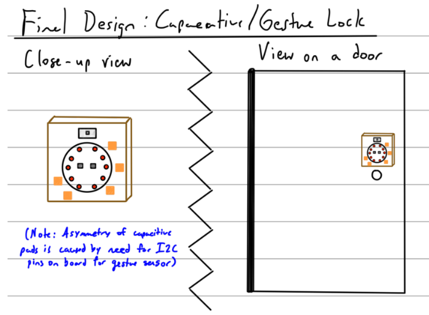

# Ph-UI!!!

**NAMES OF COLLABORATORS HERE** Rahul Jain

For lab this week, we focus both on sensing, to bring in new modes of input into your devices, as well as prototyping the physical look and feel of the device. You will think about the physical form the device needs to perform the sensing as well as present the display or feedback about what was sensed. 

## Part 1 Lab Preparation

### Get the latest content:

I have pulled the latest content.

### Start brainstorming ideas by reading: 
* [What do prototypes prototype?](https://www.semanticscholar.org/paper/What-do-Prototypes-Prototype-Houde-Hill/30bc6125fab9d9b2d5854223aeea7900a218f149)
* [Paper prototyping](https://www.uxpin.com/studio/blog/paper-prototyping-the-practical-beginners-guide/) is used by UX designers to quickly develop interface ideas and run them by people before any programming occurs. 
* [Cardboard prototypes](https://www.youtube.com/watch?v=k_9Q-KDSb9o) help interactive product designers to work through additional issues, like how big something should be, how it could be carried, where it would sit. 
* [Tips to Cut, Fold, Mold and Papier-Mache Cardboard](https://makezine.com/2016/04/21/working-with-cardboard-tips-cut-fold-mold-papier-mache/) from Make Magazine.
* [Surprisingly complicated forms](https://www.pinterest.com/pin/50032245843343100/) can be built with paper, cardstock or cardboard.  The most advanced and challenging prototypes to prototype with paper are [cardboard mechanisms](https://www.pinterest.com/helgangchin/paper-mechanisms/) which move and change. 
* [Dyson Vacuum Cardboard Prototypes](http://media.dyson.com/downloads/JDF/JDF_Prim_poster05.pdf)

 

### Gathering materials for this lab:

* Cardboard (start collecting those shipping boxes!)
* Found objects and materials--like bananas and twigs.
* Cutting board
* Cutting tools
* Markers

(We do offer shared cutting board, cutting tools, and markers on the class cart during the lab, so do not worry if you don't have them!)

## Deliverables \& Submission for Lab 4

The deliverables for this lab are, writings, sketches, photos, and videos that show what your prototype:
* "Looks like": shows how the device should look, feel, sit, weigh, etc.
* "Works like": shows what the device can do.
* "Acts like": shows how a person would interact with the device.

For submission, the readme.md page for this lab should be edited to include the work you have done:
* Upload any materials that explain what you did, into your lab 4 repository, and link them in your lab 4 readme.md.
* Link your Lab 4 readme.md in your main Interactive-Lab-Hub readme.md. 
* Group members can turn in one repository, but make sure your Hub readme.md links to the shared repository.
* Labs are due on Mondays, make sure to submit your Lab 4 readme.md to Canvas.

## Lab Overview

A) [Capacitive Sensing](#part-a)

B) [OLED screen](#part-b) 

C) [Paper Display](#part-c)

D) [Materiality](#part-d)

E) [Servo Control](#part-e)

F) [Record the interaction](#part-f)

## The Report (Part 1: A-D, Part 2: E-F)

### Part A
### Capacitive Sensing, a.k.a. Human-Twizzler Interaction 

I was able to successfully test the capacitance sensor. A short video is below.

### Part B
### More sensors

#### Light/Proximity/Gesture sensor (APDS-9960)

#### Rotary Encoder

#### Joystick

#### Distance Sensor

#### Results for the Light/Proximity/Gesture sensor, Rotary Encoder, Joystick, and Distance sensor

I was able to successfully test all of these sensors. For the Rotary Encoder, I was able to light up the LED on the board. A short video of these sensor tests is below.

### Part C
### Physical considerations for sensing

**Chosen Sensor: Adafruit Circuit Playground Express**

**\*\*\*Draw 5 sketches of different ways you might use your sensor, and how the larger device needs to be shaped in order to make the sensor useful.\*\*\***

### Sketch / Verplank Diagram 1: Capacitive Lock

The first idea is a capacitive lock which is intended to work like an (cost-effective) version of an electronic padlock with "buttons". Instead, I will use the capacitance sensors and copper tape to detect "button" presses. The neopixel lights on the lock will light up when a user is making an attempt to unlock it. Certain lights will light up green on each button press and when the enter button is pressed they will light up all green if the correct combination is entered else all red if it was wrong. Additionally, if the combination is incorrect a small buzzing sound will play.

### Sketch / Verplank Diagram 2: Light-level aware lamp

The next idea is to create a light-level aware lamp. This might be useful for people who are sitting at their desk and studying over the course of the day / night. Often times, the sun sets but people don't notice this and they end up trying to squint at their laptop screen or textbook without adequate lighting. Instead of this, the light-level aware lamp will automatically detect the light level and turn the lamp on to the correct brightness based on what level of light it detects in the room. This idea would again make use of the capacitance sensors and the neopixel LEDs on the board.

### Sketch / Verplank Diagram 3: Capacitive music controller

The next idea is to simply use the capacitance sensors to control songs that are being played. Based on the pad that is pressed, the song will change to a corresponding preselected song. In addition, a knob will be used to increase / decrease the volume and the slide switch can be used to pause / play the song.

### Sketch / Verplank Diagram 4: Arcade games

For the fourth idea, I will use the capacitance sensors to make a small arcade game device with 3 different games. The first game is the spinning light game where the light is spinning around at various speeds where the player has to press the capacitance sensor at the right time to score the points (at which point the lights will also flash green/red depending on if the selection was correct). The second game is the reaction time game, where the user will observe random lights being lit up and has to press the capacitance sensor at the right time (not early and not late) to score the points. Finally, the third game is a memory game where the lights get lit up in a sequence and the user has to try to remember the pattern. After the sequence has been lit up, they simply have to hit the correct capacitance sensor pads in the right order to score the points and advance to the next level.

### Sketch / Verplank Diagram 5: Dice alternative

The final idea is an alternative to a classic item, a die. This idea will make use of the built in accelerometer to detect a dice "roll" and then it will light up a certain (random) number of lights based on the detected motion. Additionally, the user can double tap the device to "roll" the device if they don't wish to shake it.

**\*\*\*What are some things these sketches raise as questions? What do you need to physically prototype to understand how to answer those questions?\*\*\***

The sketches raise a number of questions about the place of interaction, the positioning of the physical prototype, the physical shape and size of the device, and the people involved in the interaction. Additionally, I thought about where the additional wiring / miscellaneous pieces of the project would need to go as well as the reliability of the sensors (detection thresholds). 

For the first idea, the place of interaction would be outside a locked apartment door, the prototype would be positioned on the middle, front part of the door, would be in a circular shape (as small as possible) and the apartment residents would be the people involved. The size of this prototype is the main unknown since I have to figure out how to fit the sensor (with copper conductive tape on the contacts) and a battery case into a small device that is not too heavy so that it can attach to the front of the door. Also it cannot be too large since I don't want the device to physically extrude too far out in front of the door. I would need to physically prototype the enclosure so I can get an idea of the dimensions and how it looks on the door.

The second idea would involve a person studying at a desk in an office or bedroom, where the device is positioned on the desk or lamp base (near a window so it can detect light levels?). The size and shape should be as small as possible and match lamp base shape. For this idea, the positioning will be critical since the light sensor will be highly dependent on exactly where the device is placed. For example, if the device is placed in the center of the room, the light levels might be a bit lower than expected since it is away from the window. Thus, for this idea I would want to prototype the shape and orientation of the device so that I can understand how sensitive the sensor is and define appropriate detection thresholds.

Next, the third idea could be used in a variety of places such as a bedroom, kitchen, car, etc by anyone. In these locations, the device would be positioned in a stable place such as a table, desk, or countertop and would ideally be as small as possible and shaped like a traditional bluetooth speaker device. The main challenge with this idea is understanding if it is intuitive for the user to use the various capacitance sensors (with copper conductive tape) as "buttons", use the actual buttons to increase/decrease volume, and slide switch to pause / play the song. I would need to physically prototype the exterior casing for the device so that each of these areas of the board are easily accessible.

Similarly, the fourth idea can be used in a variety of areas by anyone. In those places, the device is ideally positioned on a table, desk, or countertop and the size would be a bit larger than the minimum space needed. This is because I want a bit more space for the copper conductive tape which is what the user will be interacting with frequently. If I didn't use a good amount of copper conductive tape the area for the interaction would be somewhat narrow, meaning that the user would have to be very precise with the button presses which is not very practical. To summarize, I would need to experiment with the size to figure out what is the optimal size for users to possibly either place the device on a surface or hold in their hand and then interact with the device.

Finally, the last idea involves multiple people playing a board game that requires the use of a die (or dice) on a coffee table. The device would be resting on the table or picked up by the person "rolling" the die. As for shape and size, the die would be shaped like a cube and as small as possible so someone could hold it in their hand. Because there are two separate ways that a user can "roll" the die (shake or double tap), the main thing to prototype is the casing and how that affects the two separate sensor inputs. The main risk for this idea is that a user goes to pick the device up to shake it, but the double tap registers instead causing the device to light up (which indicates the device roll number) earlier than expected.

**\*\*\*Pick one of these designs to prototype.\*\*\***

I chose the first idea, a capacitive lock, to prototype.

### Part D
### Physical considerations for displaying information and housing parts

I was able to run oled_test.py and put the OLED screen inside a small cardboard prototype box that I made for testing purposes. Some pictures of the box that I made **(not for the final design / chosen idea)** are located below.

**\*\*\*Sketch 5 designs for how you would physically position your display and any buttons or knobs needed to interact with it.\*\*\***

### Idea 1 Design 1

### Idea 1 Design 2

### Idea 1 Design 3

### Idea 1 Design 4

### Idea 1 Design 5

**\*\*\*What are some things these sketches raise as questions? What do you need to physically prototype to understand how to answer those questions?\*\*\***

From earlier, the biggest open question was size (dimensions) and from doing the sketches I realized that this was indeed a problem but the positioning of the device was equally important. Once again, I considered the place of interaction, the positioning of the physical prototype, the physical shape and size of the device, and the people involved in the interaction. The place and people in the interaction is simply the apartment residents trying to open their apartment door. The size of the device is as small as possible to fit all the electronics (exact dimensions to be determined still) and the variations on shape that I considered were squares / rectangles / circular. Additionally, the positioning and layout of the "buttons" or capacitive pads could vary from a grid-like shape, two columns, or even equidistant around the sensor. Finally, the placement of the device in relation to the door handle was quite important and I considered designs which for example placed it on the top / left / bottom of the handle, as well as other creative designs where the two parts are split above / below the handle or even attached separately to the door. Out of all these questions, the sketches highlighted again that the dimensions would be critical and that the positioning of the device might influence them.

In addition to the existing questions, some new ones were raised. One question was that the weight of the overall device might also influence the layout since the surface area of the device against the door would determine how much weight could be supported. Another question was whether the door handle turning might interfere with the device (especially true if the device was located below). Also, the actual sensor that I am using only has 7 capacitive contacts that I can use to take in the input. This meant that it would not be practical to lay them out like numbers on a traditional electronic keypad (requires 10 contacts for numbers 0-9). The layout also had to be aware of the fact that the "wires" should not overlap, meaning that the capacitive tape lines that connect to the sensor should have a clear path since overlapping wires will cause the sensing to not work.

To answer these questions, I would need to physically prototype the casing. This would help me to answer the question about the dimensions of the device and allow me to place the shell up against a door to see if it looks natural. I could also place all the components into the shell which would help me gauge the weight and decide the best way to attach it to the door. Placing the device up against a door would also help me understand how a user would interact with it and then the door handle since they need to be able to open the door. Finally, for the issue with the "wiring", I can first draw lines with sharpies from the sensor going outward and then place some of the capacitive tape ontop to actually test it out.

**\*\*\*Pick one of these display designs to integrate into your prototype.\*\*\***

I will prototype design 2B.

**\*\*\*Explain the rationale for the design.\*\*\*** (e.g. Does it need to be a certain size or form or need to be able to be seen from a certain distance?)

Design 2B seemed to be the most practical one since there were less uncertainties related to the open questions and it was the easiest to manufacture (circles are hard). Additionally, the design is similar to some of the commercial electronic locks that are on the market (with the exception of the button spacing). The layout of the device is also better than most of the other designs since there is an easier mapping from touch pads to the neopixel LEDs. Finally, the sizing of the device would be reasonable since it could fit everything in the back and also not appear too large on an actual door.

Build a cardboard prototype of your design.

**\*\*\*Document your rough prototype.\*\*\***

### Physical portion of the rough prototype

Pictures of the prototype with and without the capacitive tape is shown below. One minor addition that I had to make was a small notch for the power cable so that the device could be powered. As for dimensions, I used the size of the sensor as a baseline size and added ~1 inch on each side so there was enough room for the capacitive tape. Also for the weight, a few pieces of duct tape were enough to hold the device up against the wall.

### Code portion of the rough prototype

The Adafruit Circuit Playground Express did not interface with the Raspberry Pi using the Stemma QT connectors, so I had to program the board directly using the Mu Code editor (screenshot below). Additionally, I first tried to program the board with Arduino [(blink example code,](./part1_arduino_testing_scripts/blink/blink.ino) [switches example code)](./part1_arduino_testing_scripts/switches/switches.ino) and then I later realized that I could use [CircuitPython](https://learn.adafruit.com/adafruit-circuit-playground-express/circuitpython-quickstart).

To develop the software for the rough prototype, I followed many of the Adafruit [tutorials](https://cdn-learn.adafruit.com/downloads/pdf/adafruit-circuit-playground-express.pdf) (testing code: [1](./AudioFiles/CircuitPython%208.x/code.py), [2](./AudioSine/CircuitPython%208.x/code.py), [3](./CapTouch/CircuitPython%208.x/code.py), [4](./NeoPixel/CircuitPython%208.x/code.py)). The capacitive touch tutorial helped me configure the capacitance sensors and also helped me play around with the sensitivity. The NeoPixel tutorial showed me how to light up the LEDs and make different types of patterns with the lights. The AudioFiles and AudioSine tutorials showed me how to play sound out of the buzzer. I considered using a .wav file to output as sound but during the testing, I found out that the on-board speaker was not as good as I thought so I opted for the buzzer noise (generated by a sine wave). The original sources for these code snippets are here: [1](https://learn.adafruit.com/adafruit-circuit-playground-express/circuitpython-audio-out), [2](https://learn.adafruit.com/adafruit-circuit-playground-express/adafruit2-circuitpython-cap-touch), [3](https://learn.adafruit.com/adafruit-circuit-playground-express/circuitpython-neopixel).

In the process of working with some of the code, I had to manually install many different libraries onto the board, including those from the tutorials, as well as the [official library bundle](https://learn.adafruit.com/adafruit-circuit-playground-express/circuitpython-libraries). I also wanted to do some concurrent tasks but I ran into a bunch of issues with threads and the asyncio library which is [not supported on the Adafruit Circuit Playground Express due to lack of firmware and RAM space](https://learn.adafruit.com/cooperative-multitasking-in-circuitpython-with-asyncio/overview). Being able to use this library would have made a lot of my code much cleaner and more precise since I would have been able to do multiple tasks simultaneously [(asyncio example 1](https://learn.adafruit.com/cooperative-multitasking-in-circuitpython-with-asyncio/concurrent-tasks), [example 2)](https://github.com/adafruit/Adafruit_CircuitPython_asyncio/blob/main/examples/asyncio_displayio_button.py). For example, I could have sensed capacitive input at the same time as lighting up a Neopixel or maybe lit up a Neopixel at the same time as making sound from the buzzer. Instead, I had to use approximations for these operations which was acceptable for the lab. To summarize, the final version of the code for part 1 has capacitive touch sensors, neopixels (light modality), and a buzzer (sound modality). The version 1 code (simple version) is [here](./part1/code_v1.py) and the version 2 code (full version) is [here](./part1/code_v2.py).

### Behind-the-scenes video with the rough prototype

### Interacting with the rough prototype

A minor note for the video is that the buzzing sound for an unsuccessful unlock attempt is not loud enough for the video to pick it up but the user was able to hear it when testing.

LAB PART 2

### Part 2
### Part E (Optional)
### Servo Control with Joystick

I briefly experimented with the servo, but ultimately decided not to incorporate it in my final design.

### Part F
### Record

In the following sections, I detail what my capacitive and now gesture-based lock "looks like", "works like", and "acts like". The place of interaction for the apartment residents is still outside a locked apartment door and the prototype is positioned above the keyhole part of the door. The main reasoning for the addition of the gesture sensor was added security due to increased number of combinations for the patterns.

#### Looks like & Works like: Revised sketch, verplank diagram, and physical design

For part 2 of the lab, I revised the initial sketch, verplank diagram and physical design to account for some of the findings from part 1. The final sketch shows how a user can now use a gesture sensor in addition to some capacitive pads to input a combination to the lock. This is very similar to the popular Master Lock that uses directional input. Also, the physical buttons on the board serve as the "enter" button once the user wishes to test the pattern that has been input.

The verplank diagram also reflects the addition of these sensors and how a user might interact with the device. The addition of the gesture sensor also means that the Neopixel LEDs will also flicker in a certain order based on the direction of the gesture (similar to the way the corresponding LED lights up when a capacitive pad is pressed). Finally, the design shows what the device would physically look like with the addition of the gesture sensor and the reorganization of the capacitive pads.

From these diagrams, I have illustrated how the device should physically look, feel, sit, and weigh. The device is square shaped and will be as small as possible. The device does not feel out of place on the door and does not physically extrude too far out in front of the door. Finally, the device will sit above the keyhole on the door and will not weigh too much so that it can be attached to the front of the door (the final device weighed about 80 grams).

#### Looks like: Laser Cut Box Sketch

I used [Adobe Illustrator](https://www.adobe.com/products/illustrator.html) and [makercase.com](https://en.makercase.com/#/basicbox) to create a laser cut diagram for the capacative/gesture lock box. The box generation website produced the following [sketch](./part2/box.svg) which I took and imported into Adobe Illustrator. Then, I created a circular & rectangular shape on the front face of the box to accomodate the Circuit Playground Express and Gesture sensor. I also added a small notch so that the Stemma QT cable from the interior of the housing could be fed to these devices. 

The dimensions of the box are 4 inches x 4 inches on the face and a 1 inch depth. The Adafruit Circuit Playground Express is placed into a 2 inch circular cutout on the front face with a 1/4 inch square cutout for the wires. Also, the gesture sensor is 3/4 inches height by 1 inch width and it also has the 1/4 inch square cutout for the wires.

The final Illustrator sketch is located [here](./part2/box_laser_cut.ai) and an image is below (zoom into the image to see the lines).

After I had the sketch, I sent the file to the laser cutter and then I joined the pieces together with some hot glue. I left the back plate loose so that I could make modifications to the interior contents.

#### Works like: Inputs (capacitive touch sensor, buttons, I2C Gesture sensor) 

Once again, the input sensors are intended to take user input for the pattern of the combination lock. For this part, I expanded the pattern beyond the basic capacitive touch to also include gestures.

I placed the two input sensors into the box from the back and taped them to the front plate so they would not move around. Additionally, I put the battery pack inside to make sure that everything would fit properly. 

The capacitance sensor was tested in part 1 so there was little modification required. The only thing that I changed was the location and amount of capacitive pads so that I could connect the gesture sensor (more in the next paragraph). Also, the use of the Circuit Playground Express's on-board buttons saves a capacitive pad so I no longer have to use a capacitive pad as the "enter" button. Both of the on-board buttons serve as the "enter" buttons for simplicity.

Connecting the [gesture sensor](https://www.adafruit.com/product/3595) to the Adafruit Circuit Playground Express was the most challenging part of the lab. Because the Circuit Playground Express does not have a Stemma QT connector there is no way to directly use the plug-and-play wires. Instead, I had to use the Circuit Playground Express's [I2C pins](https://learn.adafruit.com/adafruit-circuit-playground-express/circuitpython-i2c) (see image below).

As seen in the images below, I first tried to form a connection to these I2C pins by inserting the wire from the front face of the old model (just for testing), and then by looping a wire into the holes from the back face and covering it with capacitive tape on both sides.

The wire looping was not reliable at all and caused many issues with the device powering on and off because some of the connections were faultly. A short video of me testing the Gesture sensor is shown below. I had to place the box on its side to get a better connection for the I2C pins. However, most of my tests with this configuration still resulted in the following error message which showed that the Gesture sensor could not be read.

Instead of this method, I opted to solder the connections to make them more reliable (see images below). A short video of the gesture sensor working (post-soldering) is in the next section.

#### Works like: Outputs (Neopixel LEDs, speaker/buzzer)

The output mechanisms for the device include the neopixel LEDs and the speaker/buzzer which serve to give feedback to the user about their selections for the lock's pattern. The Neopixel LEDs light up under different circumstances. First, it will light up all red is when the lock is currently locked and the user is not interacting with it. Second, on capacitive touch pad input presses the corresponding Neopixel LED will light up green indicating to the user that their input was recognized (this does not signify that that individual pad press was correct). Finally, when the user gestures (up/down/left/right), the 10 Neopixel LEDs will light up in a specific pattern based on the direction. For example, if the gesture was upwards, the bottom most LEDs will flash green first, followed by the ones above those, until the topmost ones. This gives the visual effect of the direction on the LEDs and serves as a nice way to show the direction of the gesture on the LEDs. Please see below for the video showing the gesture sensor functionality. Also, the Circuit Playground Express's on-board speaker (which really serves as a buzzer) is able to play a sharp tone when the entered combination for the lock is entered incorrectly (see part 1 behind the scenes video).

#### Works like: Installing CircuitPython Libraries & Running Other Sensor Tests

Another challenge for the lab was figuring out what sensors that were [compatible for use with the Adafruit Circuit Playground Express](https://docs.circuitpython.org/projects/bundle/en/latest/drivers.html). One of my early ideas for part 2 of the lab was to use a distance sensor to detect if there was a user trying to unlock the device and automatically switch from a rainbow pattern (idle mode) to all red (locked state). Unfortunately, the [VL53L3CX Multi-Distance sensor](https://www.sparkfun.com/products/17072) was not on the approved list of drivers for use with the Circuit Playground Express and when I tried some of the similar libraries (see image below and [1](https://github.com/sparkfun/Qwiic_VL53L1X_Py), [2](https://qwiic-vl53l1x-py.readthedocs.io/en/latest/index.html)) for other time of flight sensors, I received an error stating that I was using the wrong sensor. 

An alternate solution that I considered was using the Circuit Playground Express's microphone to try to detect noise and use that as an indication of a user trying to unlock the door. This sensor test worked but from a design perspective, it would not always be a good indicator of whether a person is unlocking the door (since if a person is alone, they might not speak / make noise). Another sensor that I tried to use was the light sensor where a lower light level might indicate that the user was trying to unlock the door. This was also messy because light levels would have to be calibrated and a person passing by might cause the threshold to be hit (which is not terrible but still not desirable). The final idea was to use a separate proximity sensor which has the added bonus of being a part of the gesture sensor which has libraries that work with the Circuit Playground Express. Although individually both the gesture sensing and proximity sensing work as expected, using both of them simultaneously did not seem to work on my device (kept receiving a Memory allocation error). In addition, the logic to incorporate this would have been very complicated to implement especially since asynchronous operations are not possible. Thus, I had to drop this feature from the final design.

#### Works like: Final Code

The final code for the lab is located [here](./part2/code.py). There are a number of components to the code which include things like lighting up the Neopixel LEDs, checking for capacitive input or gestures, and checking if the entered pattern is correct.

In addition, the final libraries that I had to install onto the Circuit Playground Express are shown below. They are mainly used for the gesture sensor and the neopixel LEDs. They can be obtained by downloading the [CircuitPython Community Library Bundle](https://circuitpython.org/libraries) and seeing which ones are [compatible](https://docs.circuitpython.org/projects/bundle/en/latest/drivers.html) with the board.

#### Works like and Acts like: Behind-the-scenes testing

A short video of some of the behind-the-scenes testing is shown below. Note that the "correct" passcode is "632UDT" which translates to hitting pad 6, 3, 2 then gesturing up, down, and finally hitting pad T (named T because it corresponds to the TX pin on the board). When the correct pattern is entered, the Neopixel LEDs light up green and when the wrong one is entered, they light up red and the buzzer sounds as expected. A minor note is that after the code has been checked the lights flash in a rainbow pattern to indicate a reset.

#### Acts like: User testing

A short video of some of the user tests is shown below. As in part 1, the buzzer is too faint to be heard on camera but the user could hear it.

I also expanded my original use case for an apartment to include any other setting in which a door lock is required. A short video for this is below.

### References

* https://docs.circuitpython.org/projects/bundle/en/latest/drivers.html#distance-sensors

* https://docs.circuitpython.org/projects/vl53l1x/en/latest/

* https://learn.sparkfun.com/tutorials/qwiic-distance-sensor-vl53l1x-vl53l4cd-hookup-guide/all

* https://docs.circuitpython.org/projects/apds9960/en/latest/examples.html#gesture-example

* https://github.com/adafruit/Adafruit_CircuitPython_APDS9960/blob/main/examples/apds9960_gesture_simpletest.py

* https://web.cecs.pdx.edu/~gerry/class/IB2021/programming/external/i2c/

* https://docs.circuitpython.org/projects/simpleio/en/latest/api.html

* https://learn.adafruit.com/adafruit-circuit-playground-express/circuitpython-i2c

* https://learn.adafruit.com/adafruit-circuit-playground-express/circuitpython-audio-out

* https://learn.adafruit.com/adafruit-circuit-playground-express/playground-light-sensor

* https://learn.adafruit.com/adafruit-circuit-playground-express/circuitpython-libraries

* https://en.makercase.com/#/basicbox

