# Observant Systems

**NAMES OF COLLABORATORS HERE** Rahul Jain

For lab this week, we focus on creating interactive systems that can detect and respond to events or stimuli in the environment of the Pi, like the Boat Detector we mentioned in lecture. 
Your **observant device** could, for example, count items, find objects, recognize an event or continuously monitor a room.

This lab will help you think through the design of observant systems, particularly corner cases that the algorithms need to be aware of.

## Prep

1. Spend about 10 Minutes doing the Listening exercise as described in [ListeningExercise.md](https://github.com/FAR-Lab/Interactive-Lab-Hub/blob/Fall2022/Lab%205/ListeningExercise.md)
2.  Install VNC on your laptop if you have not yet done so. This lab will actually require you to run script on your Pi through VNC so that you can see the video stream. Please refer to the [prep for Lab 2](https://github.com/FAR-Lab/Interactive-Lab-Hub/blob/Fall2022/Lab%202/prep.md), we offered the instruction at the bottom.
3.  Read about [OpenCV](https://opencv.org/about/), [MediaPipe](https://mediapipe.dev/), and [TeachableMachines](https://teachablemachine.withgoogle.com/).
4.  Read Belloti, et al.'s [Making Sense of Sensing Systems: Five Questions for Designers and Researchers](https://www.cc.gatech.edu/~keith/pubs/chi2002-sensing.pdf).

### For the lab, you will need:
1. Pull the new Github Repo.(Please wait until thursday morning. There are still some incompatabilities to make the assignment work.)
1. Raspberry Pi
1. Webcam 

### Deliverables for this lab are:
1. Show pictures, videos of the "sense-making" algorithms you tried.
1. Show the filledout answers for the Contextual Interaction Design Tool.
1. Show a video of how you embed one of these algorithms into your observant system.
1. Test, characterize your interactive device. Show faults in the detection and how the system handled it.

## Overview
Building upon the paper-airplane metaphor (we're understanding the material of machine learning for design), here are the four sections of the lab activity:

A) [Play](#part-a)

B) [Fold](#part-b)

C) [Flight test](#part-c)

D) [Reflect](#part-d)

---
### Lab Prep

I did the listening exercise and the results are [here](./ListeningExercise.md).

### Part A
### Play with different sense-making algorithms.

#### OpenCV

**\*\*\*Try each of the following four examples in the `openCV-examples`, include screenshots of your use and write about one design for each example that might work based on the individual benefits to each algorithm.\*\*\***

### Contour Detection

I was able to run the contour detection script on the Queensboro Bridge and it seemed to pick up many of the contours. It wasn't perfect but did a decent job. In general, contour detection is useful for identifying the boundaries of different shapes. One design that contour detection could be used for is separating coins from dollar bills. The coins would have a circular shape while dollar bills would be rectangles (or squares if folded).


### Face Detection

I was able to run the face detection script on myself and it seemed to pick up my face and also thought I had multiple eyes (green boxes). In general face detection can be applied to many use cases where one wants to check whether a person is present or not. One design that face detection could be used for is a smart security system where it would notify the homeowner when a face was detected so they could make a decision whether or not to let them in.


### Optical Flow 

I was able to run the optical flow test where it traced different points as I moved around the screen. In general this is good for figuring out how objects are moving in a space and tracking them. One design that this could be used for is a movie/video stabilization device which tries to reorient the camera position based on how something in the shot is moving / shaking. So for example if the person holding the camera is running, the image might be shaky so this could help stabilize the image. Another example could be detecting traffic flow.


### Object Detection

I was able to run the object detection test where it drew a bounding box around my computer mouse. In general this is good for figuring out what and how many of different objects appear in the image. One design that this could be used for is identifying how busy a particular parking lot is. For example, if there are a lot of cars parked then we know that it is fairly busy.


#### Filtering, FFTs, and Time Series data. 

**1. Set up threshold detection** Can you identify when a signal goes above certain fixed values?

Yes. I was able to set a threshold on the volume to print a line whenever it was above 85 (which I found from being silent in the room). Thus whenever I spoke, the volume would increase and the threshold would be hit.

```
# Threshold Detection
if volume > 85:
    print("The volume is greater than 85:", volume)
```

**2. Set up a running averaging** Can you set up a running average over one of the variables that are being calculated.[moving average](https://en.wikipedia.org/wiki/Moving_average)

Yes. I was able to print out the running average of the volume. This is simply the sum of the volumes / number of volume points.

```
# Running Average
if len(VolumeHistory) != 0:
    print("The volume running average is", np.sum(VolumeHistory) / len(VolumeHistory))
```

**3. Set up peak detection** Can you identify when your signal reaches a peak and then goes down?

Yes. I was able to print out a line whenever a peak occured in the volume. I simply looked at three points and if the center measurement was higher than both the left and right by some threshold, I considered it to be a peak. There are probably more advanced ways to do this, but this simple approximation seems to work fine.

```
# Peak Detection
if len(VolumeHistory) > 2:
    peak_threshold = 5
    if (VolumeHistory[-3] - VolumeHistory[-2] < -peak_threshold) and (VolumeHistory[-2] - VolumeHistory[-1] > peak_threshold):
        print("Peak detected!")
```

**\*\*\*Include links to your code here, and put the code for these in your repo--they will come in handy later.\*\*\***

The code for these tests is located [here](./ExampleAudioFFT.py) and a short video is below.

[](https://www.youtube.com/watch?v=r0I9Pp5WC_s)

### (Optional Reading) Introducing Additional Concepts

I ended up bricking my Pi's SD card... so I decided to install the old RPi image which I found [here](https://github.com/FAR-Lab/Interactive-Lab-Hub/blob/Spring2021/Lab%202/prep.md).


#### MediaPipe

I was able to run the [MediaPipe](https://mediapipe.dev/) test (screenshot and video below).


[](https://www.youtube.com/watch?v=vpBuVtDPl2I)

**\*\*\*Consider how you might use this position based approach to create an interaction, and write how you might use it on either face, hand or body pose tracking.\*\*\***

One idea is to make a rock paper scissors game using hand tracking. Using 2 camera inputs, I could possibly run the mediapipe script to detect which hand shape the players are making and output a decision.

#### Teachable Machines

I was able to run the [TeachableMachines](https://teachablemachine.withgoogle.com) test (video below)

[](https://www.youtube.com/watch?v=gvn3inwG-9E)

**\*\*\*Whether you make your own model or not, include screenshots of your use of Teachable Machines, and write how you might use this to create your own classifier. Include what different affordances this method brings, compared to the OpenCV or MediaPipe options.\*\*\***

The teachable machines modeling allows for image recognition of arbitrary items based on previous items. OpenCV tries to use things like contour detection, face detection, flow detection, and object detection to identify whether things appear in the camera image but it cannot easily tell you what those things are. Similarly, MediaPipe enables face, face mesh, hand pose, and body pose detection but again can't really identify the difference between two faces for example because it is looking at the structure.

### Part B
### Construct a simple interaction.

* Pick one of the models you have tried, and experiment with prototyping an interaction.
* This can be as simple as the boat detector showen in a previous lecture from Nikolas Matelaro.
* Try out different interaction outputs and inputs.
* Fill out the ``Contextual Interaction Design Tool`` sheet.[Found here.](ThinkingThroughContextandInteraction.png)

**\*\*\*Describe and detail the interaction, as well as your experimentation here.\*\*\***

Before I decided on my interaction, I did some experimentation on recognizing different poker chips to see if the TeachableMachines classification would work (which it did). The keras file for the TeachableMachines classifier is [here](./models/blue_versus_red_keras.zip).


### Wizard of Odds

The model that I picked was the TeachableMachines classification. The interaction that I chose was a group of people playing the card game blackjack. The goal for the interaction is to have a device (called the Wizard of Odds) calculate recommended actions based on what cards the player has and what card the dealer is showing. The TeachableMachines classifier will automatically recognize the number that each card represents and will learn to recognize them regardless of suite. Also, the device should signal the player with a recommended action through an LED strip or voice output. The Contextual Interaction Design Tool sheet is filled out below.


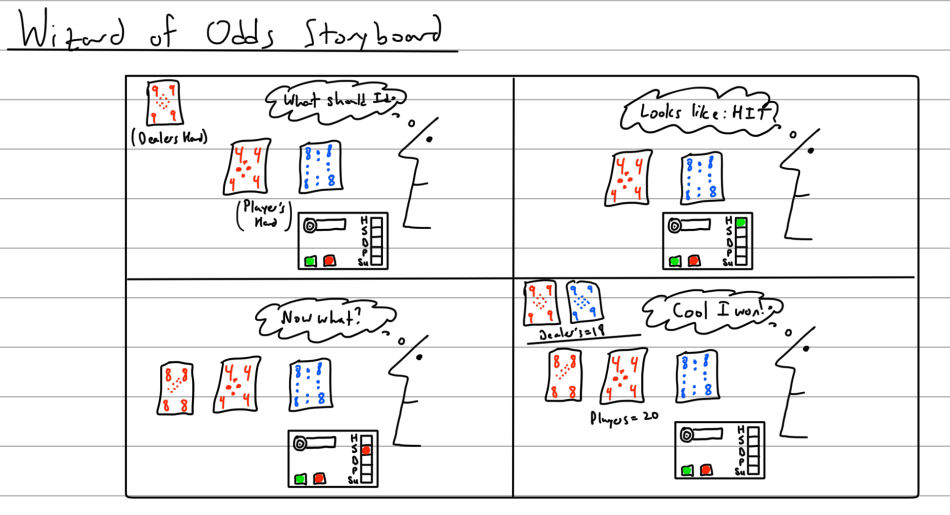


### Part C
### Test the interaction prototype

Now flight test your interactive prototype and **note down your observations**:
For example:
1. When does it do what it is supposed to do?
1. When does it fail?
1. When it fails, why does it fail?
1. Based on the behavior you have seen, what other scenarios could cause problems?

**\*\*\*Think about someone using the system. Describe how you think this will work.\*\*\***
1. Are they aware of the uncertainties in the system?
1. How bad would they be impacted by a miss classification?
1. How could change your interactive system to address this?
1. Are there optimizations you can try to do on your sense-making algorithm.

For the first test, I tried to do a two versus ten classifier. When I was capturing image samples, I rotated the cards so that it would be able to understand different orientations and capture that in the model. I also used all 4 variations of 2's and 4 variations of 10's. I didn't however include a background class which would be helpful for the future. A short video is below. The keras file for the TeachableMachines classifier is [here](./models/two_versus_ten_keras.zip) and tensorflowlite version is [here](./models/two_versus_ten_tflite.zip). I exported the tensorflowlite version as well because I saw [here](https://www.tensorflow.org/lite/guide/python) that it might be possible to run it that way on the Raspberry Pi as well.


[](https://www.youtube.com/watch?v=HZEc9LwuTio)

This test was incredibly successful and whenever I held up a card it would be able to classify it correctly. It would fail sometimes if I held up both the two and ten in the same image or if I didn't have any card in the image. These failures are due to the fact that there is no class for both of the cards and also no class for no cards. Other scenarios that can occur are identifying whose card is being classified at that point in time. To handle the uncertainty around identification of whose card is being classified, I will have the player assume that they should input the dealer's card into the system first and then their cards. Also, I will have the player press a button to manually capture the card that they want to process into the system. If there was a misclassification, it is not a big deal because they can just hit the reset button and scan the cards into the system again. There is no need to change the system further because I have handled these cases. Some additional optimizations could be to play around with the rotation of the card to see how the number of training examples impacts the model accuracy and also the overall model size. For example, since the card is likely symmetric, I don't necessarily need to have both the 0 degrees and 180 degrees training images. Also, I realized later that in Blackjack the 10, Jack, Queen, and King all have the same numerical value of 10, so I could potentially try to condense them down into one class.

Overall, the use of the Wizard of Odds device will work as follows. The dealer will hand out two cards to the player and show one of the dealer's cards to the player. The player will scan the dealer's card first and then scan their cards. Note that to scan a card, the player points the camera part of the device at the card (one at a time) and then presses a button. Once the three cards are scanned, the Wizard of Odds device will do a calculation and then recommend an action by lighting up a light on the LED panel. If further cards are dealt to the player in the same hand, the player can scan those additional cards in and the recommendation will update. Once the interaction is complete, the player can reset the count by pressing the other button and repeat the process.

### Part D
### Characterize your own Observant system

Now that you have experimented with one or more of these sense-making systems **characterize their behavior**.
During the lecture, we mentioned questions to help characterize a material:
* What can you use X for?
* What is a good environment for X?
* What is a bad environment for X?
* When will X break?
* When it breaks how will X break?
* What are other properties/behaviors of X?
* How does X feel?

**\*\*\*Include a short video demonstrating the answers to these questions.\*\*\***

For this part, I tried to make a more complicated classifier with all the classes (13 + 1 background class). This can be used for detecting the number of each card (note that the suite does not matter and makes the classification simpler). A good environment for this classification is anywhere with normal light levels as low light levels would make it hard for the camera to pick up on the features of the image and classify it properly. The classification might break if the player mistakenly scans two or more cards. If that happens, it might show an incorrect sum since the wrong number would be input to the system. In the complex classifier, I will include an empty background class to account for the no cards case. Another thing to consider is the distance with which to hold the device from the card surface. If it is two close, the classifier may not be able to pick up and scan the entire card in. Finally, the entire device should not feel too clunky and should be easy to hold in one's hands. I also drew a more detailed diagram (first draft sketch) about how the Wizard of Odds device will look and feel like (below). A short video that shows how the classifier works is shown below as well. The classifier seemed to work pretty well for most of the numbers. It had some trouble with the ace and five and a few of the face cards were mistaken for other face cards (totally ok!). For the final classifier, I can also try to increase the number of epochs. The keras file for the TeachableMachines classifier is [here](./models/card_numbers_keras.zip). I also ran one for 150 epochs, and that classifier is [here](./models//card_numbers_150_keras.zip). The raw samples are [here](./samples/).


[](https://www.youtube.com/watch?v=BdQmkDdYr3k)

I was also able to run the classifier on the Raspberry Pi! The code is [here](./wizard_of_odds/wizard_of_odds_basic.py).


### Part 2.

Following exploration and reflection from Part 1, finish building your interactive system, and demonstrate it in use with a video.

For the second part of the lab, I finished building my design. The interaction that I am prototyping is a group of people playing blackjack. The goal for the interaction is to have a device (called the Wizard of Odds) calculate recommended actions for someone who doesn't know how to play. The actions will be based on what cards the player has and what card the dealer is showing. The device signals the player through an LED strip and voice. The development for part 2 included developing the blackjack strategy, creating a casing, writing the code, and testing it with a user. I also added support for verbally speaking the recommended action using Google TTS and also lit up the LEDs for the buttons when they are pressed.

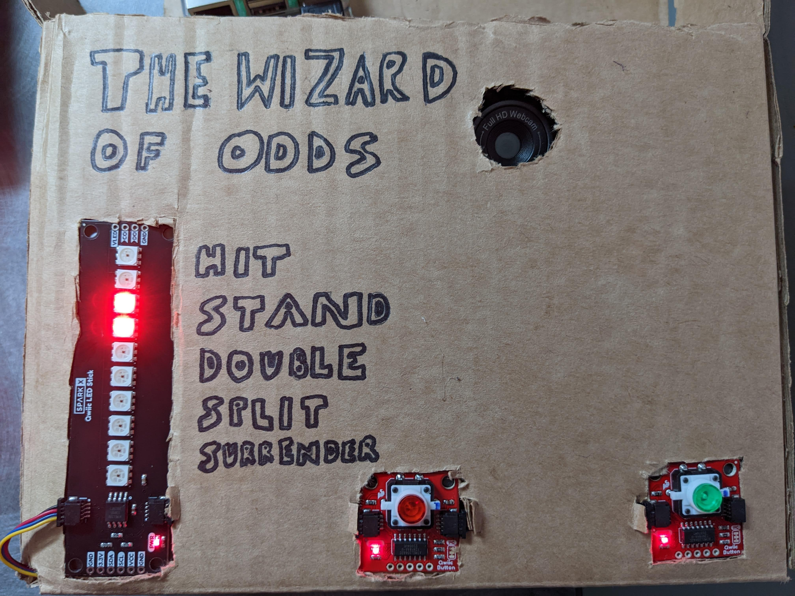

I also updated the Contextual Interaction Design Tool to reflect the results of the progress made in part 2 of the lab. Notably, the Wizard of Odds device provides visual / audio feedback to the player. I decided not to incorporate other features like calculating the payout, showing the total sum of a players hand, or displaying the probability because it would have required a screen to effectively communicate the information. The time for the interaction should be as minimal as possible so that player can continue and win as many blackjack games as possible!

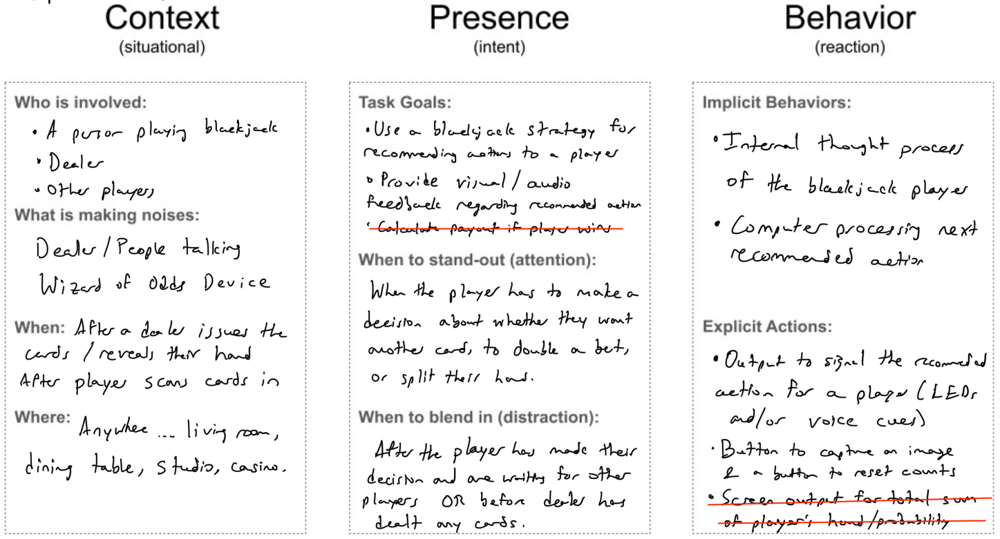


### Blackjack Strategy

I encoded the following strategy chart in code so that based on the cards read in, the wizard can make a prediction of what action the player should take. For simplicity, I considered 5 different actions (Hit, Stand, Double, Split, and Surrender). Based on what recommended action is output, the wizard will light up certain LEDs on the strip.

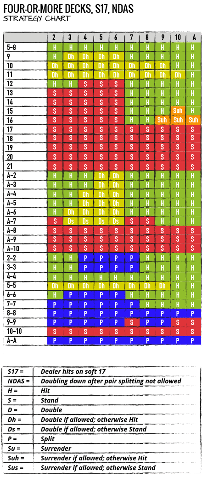

### Physical Hardware Construction

I reconsidered my original design by thinking about a 2 sided device where the camera would be positioned on the opposite side. This would kind of look like a "camera" where the user would point the device at the card and "snap" a photo by pressing the button. I quickly realized that this would have the major problem of properly lining up the camera lens with the card, so I reverted back to my original design and tweaked it a little bit. The two designs (alternative and final) are shown below.

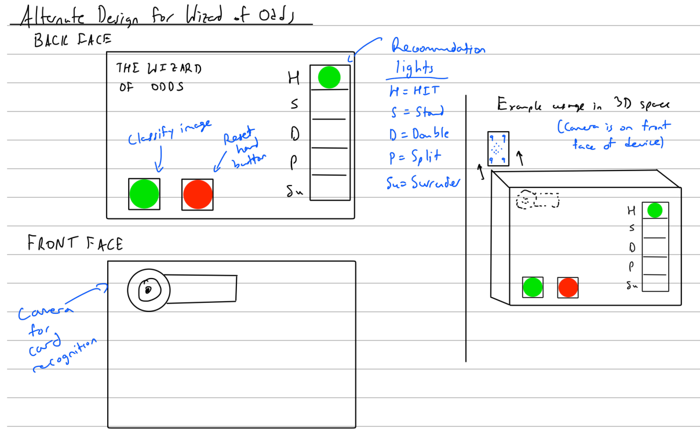

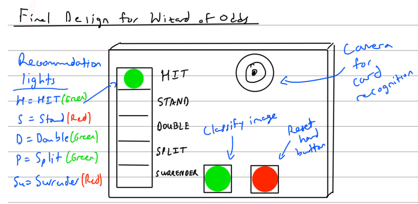


I created a simple cardboard casing and created holes for the different sensors to match the original design from part 1. The casing holds the camera, Raspberry Pi, battery pack, and all the wiring. In addition, the LED strip, and two push-buttons are attached to the front face of the casing so the user can interact with them. I also put some cardboard inserts inside so that things inside didn't slide around. This was especially important for the camera since the lens has to be lined up with the hole to actually see outside. I originally designed a 12" x 6" x 2.5" box but found that there was too much empty space so I reduced the size to 8" x 6" x 2.5".

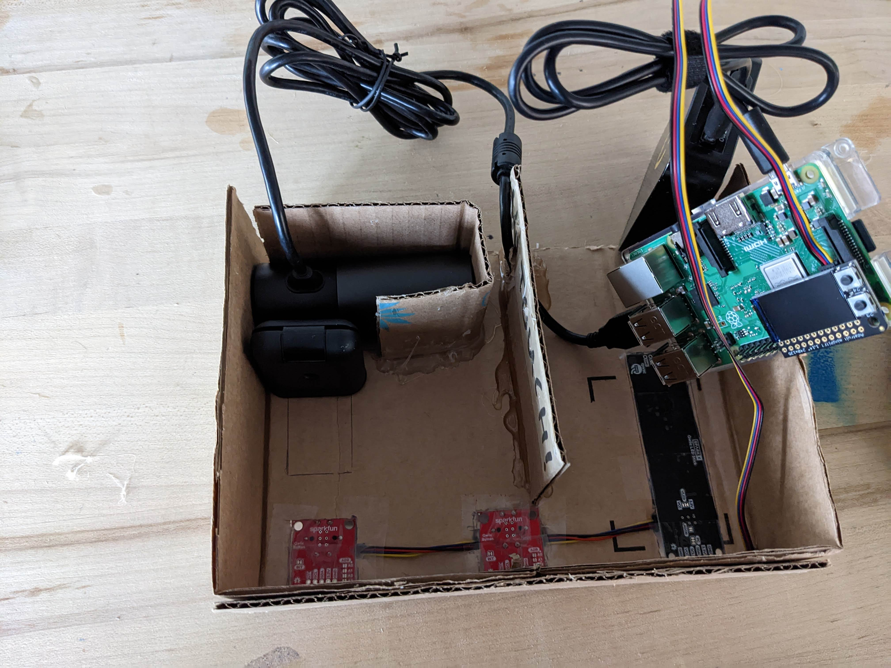

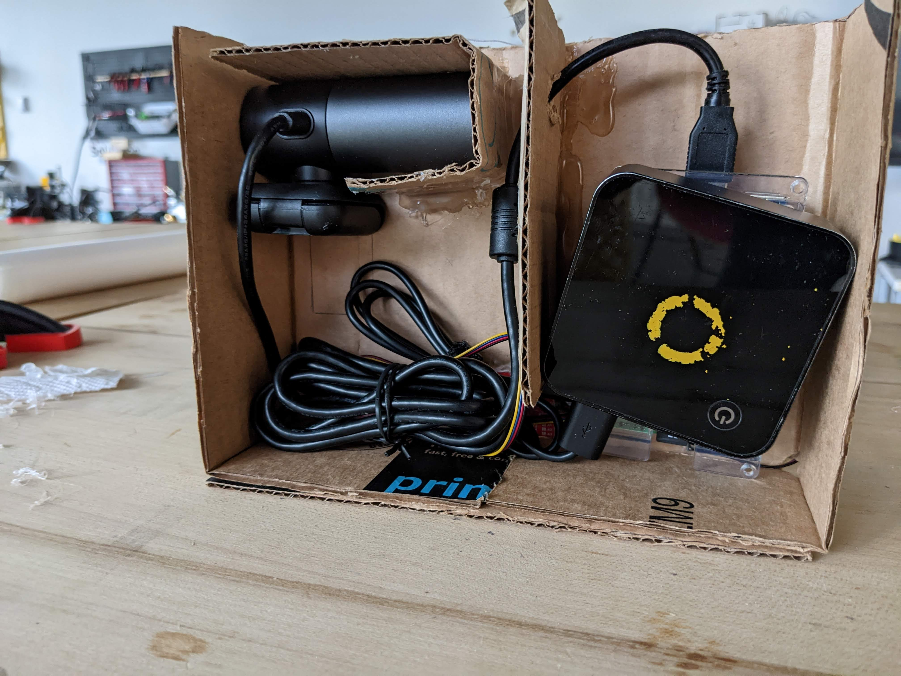

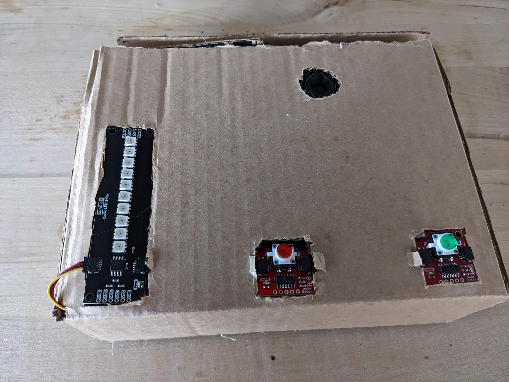

### Software Development

I ran a number of individual tests to make sure that each of the sensors was working properly. The test for the LED stick is located [here](./led_stick_test.py) and the test for the Qwiic buttons is [here](./qwiic_two_buttons_test.py). When I was testing the Qwiic buttons, I quickly found out that since both buttons are sending data over the same I2C address, the I2C address for one of them would need to be changed. I used [this script](./qwiic_change_button_i2c.py) to do that. After that was done, I confirmed that the I2C address was changed by running i2cdetect which showed that the buttons were at 0x5B and 0x6F while the LED strip was at 0x23. Another thing that I noticed when changing the I2C addresses was that only one button should be connected to the Pi when running the script, else it would change both buttons' I2C addresses.

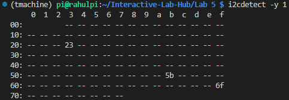

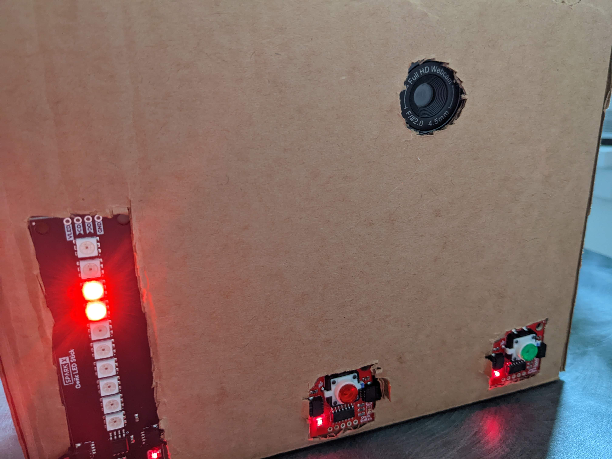

Once the simple tests were done, I started to develop the main script for the wizard of odds device. I started by encoding the blackjack strategy table into code (see [here](./blackjack_strategy.py)). Then I built off the [basic code](./wizard_of_odds/wizard_of_odds_basic.py) for the loading the teachable machines keras model. The teachable machines keras model that I used included 14 classes (13 suites + 1 background), and I trained the model on approximately 250-300 images per class (total dataset size was approx 4000 images). I did notice that increasing the number of training samples made my model more accurate. The major additions included code for interpreting the blackjack strategy, querying the strategy table, pressing buttons to capture an image or reset the card hands, as well as outputing the recommended action on the LED strip. I also lit up the buttons when they were pressed and had Google TTS speak the recommended action. The final code is [here](./wizard_of_odds/wizard_of_odds.py). A short video for some of the behind-the-scenes testing is shown below.

[](https://www.youtube.com/watch?v=00gOoor1UhI)

### Final Result

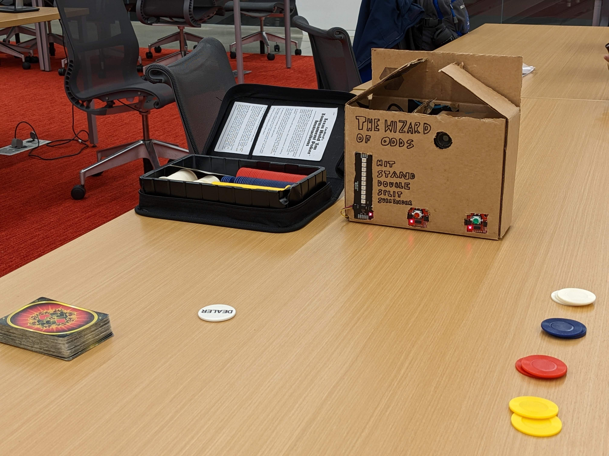

**\*\*\*Include a short video demonstrating the finished result.\*\*\***

A video showing the final interaction is shown below. Although the image classification was not perfect, it shows the concept (and in many cases the outputted result - Hit, Stand, etc - is the same according to the table, so a little bit of inaccuracy is actually acceptable). A better classification model would definitely improve the device further. The video also shows the Google TTS telling the player verbally what to do (turn the volume up!) and the button LEDs also light up when pressed.

[](https://www.youtube.com/watch?v=HUpQDRUeg5I)

### Sources

* https://www.888casino.com/blog/blackjack-strategy/best-blackjack-strategies

* Inspiration for the name: https://wizardofodds.com/games/blackjack/hand-calculator/

* https://www.blackjack.org/blackjack/strategy/

* https://www.tensorflow.org/lite/guide/python

* https://learn.sparkfun.com/tutorials/sparkfun-qwiic-button-hookup-guide/python-package

* https://github.com/sparkfun/Qwiic_Button_Py/blob/main/examples/qwiic_button_ex1_buttonPress.py

* https://github.com/sparkfun/Qwiic_Button_Py/blob/main/examples/qwiic_button_ex6_changeI2CAddress.py

* https://github.com/sparkfun/Qwiic_Button_Py/blob/main/examples/qwiic_button_ex7_2Buttons.py

* https://github.com/sparkfun/Qwiic_LED_Stick_Py/blob/main/examples/qwiic_led_stick_ex2_single_pixel.py

* https://github.com/sparkfun/Qwiic_LED_Stick_Py/blob/main/examples/qwiic_led_stick_ex1_blink.py

* https://learn.sparkfun.com/tutorials/sparkfun-qwiic-button-hookup-guide/all

* https://learn.sparkfun.com/tutorials/sparkfun-qwiic-button-hookup-guide/resources-and-going-further

* https://learn.adafruit.com/scanning-i2c-addresses/raspberry-pi

* https://learn.sparkfun.com/tutorials/qwiic-kit-for-raspberry-pi-hookup-guide/troubleshooting

* https://github.com/sparkfun/Qwiic_Button_Py/blob/main/examples/qwiic_button_ex2_LEDon.py

* https://stackoverflow.com/questions/26006387/using-python-3-on-a-raspberry-pi-how-to-call-mplayer-and-passing-a-url

* https://ubuntuforums.org/showthread.php?t=2213319

* https://ubuntuforums.org/showthread.php?t=2039557

* https://blackonsole.org/failed-to-open-lirc-support/

* https://github.com/sparkfun/Qwiic_LED_Stick_Py/blob/main/examples/qwiic_led_stick_ex8_walking_rainbow.py