# Little Interactions Everywhere

**NAMES OF COLLABORATORS HERE** Rahul Jain, Yusef Iskandar (for part E)

## Prep

1. Pull the new changes from the class interactive-lab-hub. (You should be familiar with this already!)
2. Install [MQTT Explorer](http://mqtt-explorer.com/) on your laptop. If you are using Mac, MQTT Explorer only works when installed from the [App Store](https://apps.apple.com/app/apple-store/id1455214828).
3. Readings before class:
   * [MQTT](#MQTT)
   * [The Presence Table](https://dl.acm.org/doi/10.1145/1935701.1935800) and [video](https://vimeo.com/15932020)

## Overview

The point of this lab is to introduce you to distributed interaction. We have included some Natural Language Processing (NLP) and Generation (NLG) but those are not really the emphasis. Feel free to dig into the examples and play around the code which you can integrate into your projects if wanted. However, we want to emphasize that the grading will focus on your ability to develop interesting uses for messaging across distributed devices. Here are the four sections of the lab activity:

A) [MQTT](#part-a)

B) [Send and Receive on your Pi](#part-b)

C) [Streaming a Sensor](#part-c)

D) [The One True ColorNet](#part-d)

E) [Make It Your Own](#part-)

## Part 1.

### Part A
### MQTT

For this part, I was able to successfully publish to the `IDD` topic.

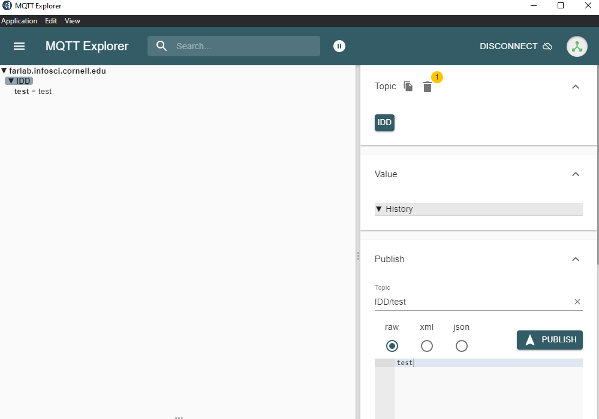

### Part B
### Send and Receive on your Pi

[sender.py](./sender.py) and and [reader.py](./reader.py) show you the basics of using the mqtt in python. Let's spend a few minutes running these and seeing how messages are transferred and shown up. Before working on your Pi, keep the connection of `farlab.infosci.cornell.edu/8883` with MQTT Explorer running on your laptop.

**Running Examples on Pi**

I installed the requirements and was able to run the sender and reader scripts. Please see below for images from the tests. The first image is the sender test where I sent a message from the Pi and it was received on the MQTT Explorer. The second image is the receiver test where I sent a message from the Pi and then received it back on the MQTT Explorer.

First image:

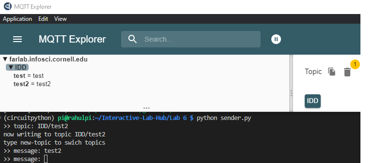

Second image:

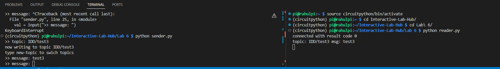

**\*\*\*Consider how you might use this messaging system on interactive devices, and draw/write down 5 ideas here.\*\*\***

Idea 1: Warehouse (Safety) Monitoring

In order to promote ensure proper warehouse operation (eg safety), monitor things like noise level, light level, temperature level, air quality, boxes falling, reversing forklifts (distance sensor), # people in an area, etc. Sensors can be placed at different locations throughout the warehouse and monitor for different things. The sensor readings can be delivered to the warehouse management who will monitor for abnormal readings and take corrective actions if something is wrong.

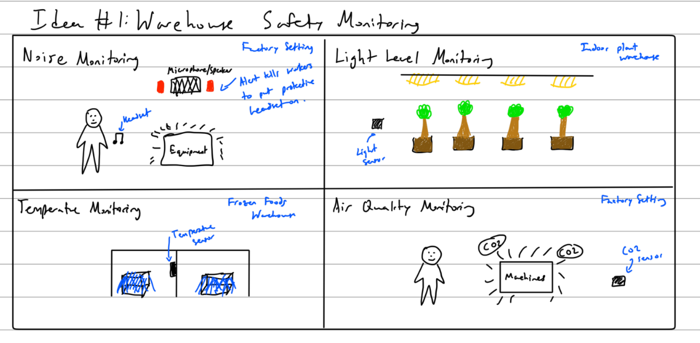

Idea 2: Blue Light System for college campuses

In order to promote public safety, position a distributed blue light system around a college campus. If someone needs help, they can press a button which will send a message over MQTT to public safety officers. The officers can reply that help is on the way which can be displayed to the users as an LED or screen output. The screen for example could display some basic info like the time of request, ETA, etc. The public safety officers can also broadcast out alerts out to the devices so that people passing by can be notified on-the-go.

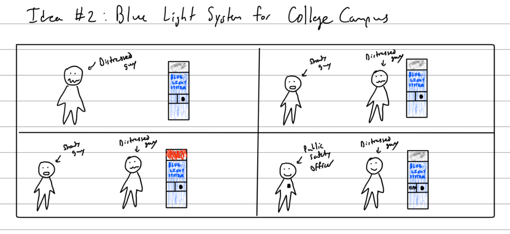

Idea 3: Elevator Motion Tracking

For this idea, use an accelerometer to track the motion of an elevator to see how many trips are being taken and at what times. This information can be logged and used to extract different trends. This might be useful to apartment staff trying to judge the best time to make stops at the different floors to take out the recycling.

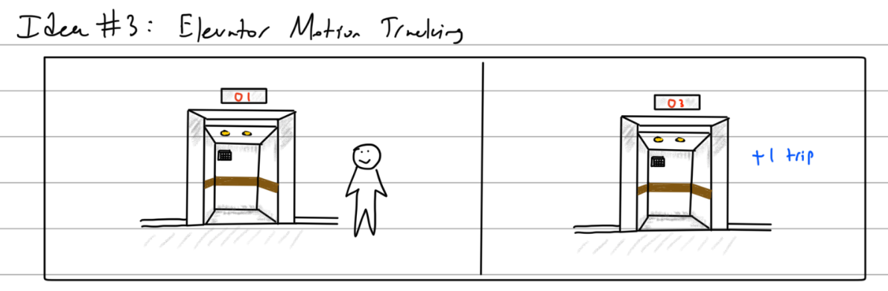

Idea 4: Study Room In-Use Detection

This idea simply will try to count the number of study rooms that are free or in use and display that information to people looking for a study room. The different sensing mechanisms that I considered include light-based, motion-based, accelerometer-based, or camera-based mechanisms. Each of these methods have pros and cons. For example, the light sensor will be cheap and easy to do but may be inaccurate. On the other hand, the camera-based detection is expensive (and not to mention the privacy issues), but it has greater accuracy.

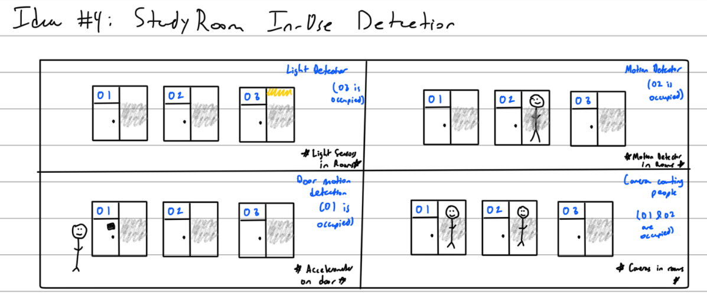

Idea 5: Election Day Secure Voting System

Since election day is coming up, I was thinking about ways to use a distributed system + MQTT with vote tallying. One version of this could be to have users sign in with facial recognition then use knobs/buttons to select their candidate. Once their selection is made, their vote is securely sent (encrypted / hashed etc.) to a central location where it can be tallied up. I was inspired for this idea by the [Bulletin Board Voting System](https://ieeexplore.ieee.org/abstract/document/6045953). Another version of this, could be to have poll workers use a teachable machines ML model to scan the ballots in and also send the votes in the same way.

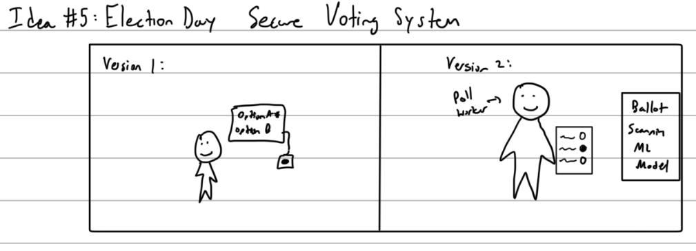

### Part C
### Streaming a Sensor

**\*\*\*Include a picture of your setup here: what did you see on MQTT Explorer?\*\*\***

I was able to see the capacitive sensor streaming on the MQTT Explorer window. Also for the next part, I could see the distance sensor streaming in the window as well. A picture of the MQTT explorer window, the capacitive sensor setup, and a short video of the capacitive sensor data streaming is below.

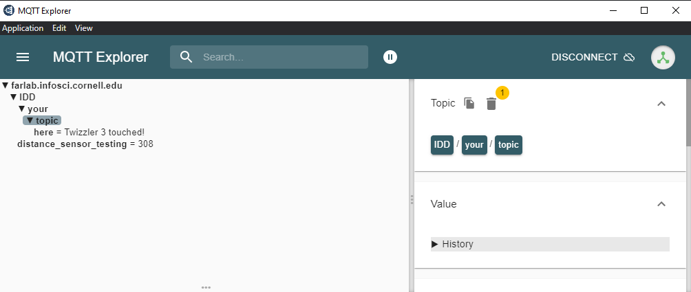

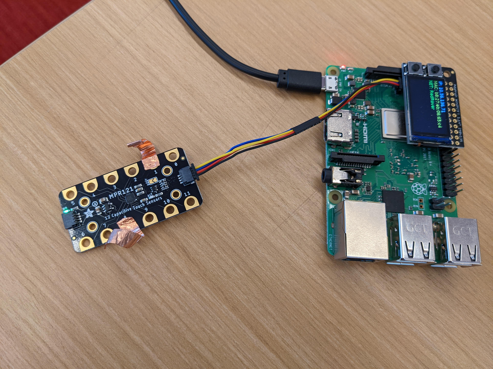

**\*\*\*Pick another part in your kit and try to implement the data streaming with it.\*\*\***

I connected a distance sensor and implemented data streaming with it. A picture of the setup and short video showing the data streaming is below. The script for this part is [here](./distributed_distance_sender.py).

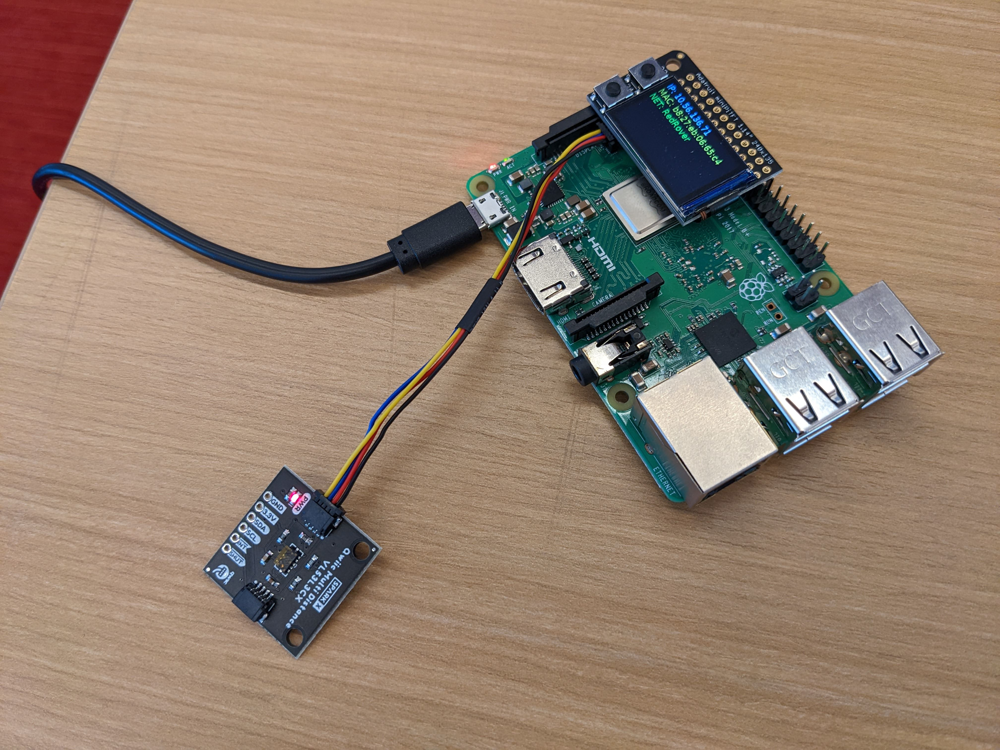

### Part D
### The One True ColorNet

**\*\*\*Can you set up the script that can read the color anyone else publish and display it on your screen?\*\*\***

Yes. I have used the [color script](./color.py) to read the colors and display it on my screen.

### Part E
### Make it your own

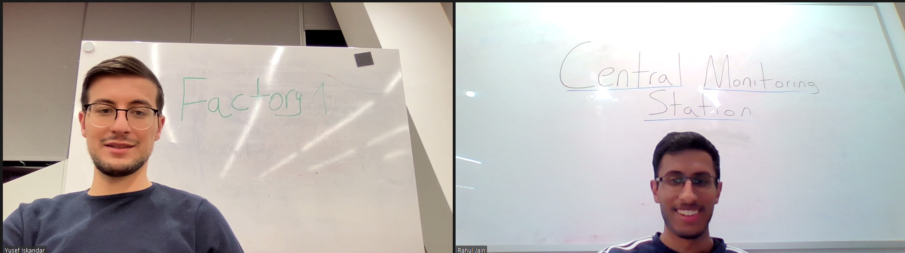

**\*\*\*1. Explain your design\*\*\*** 

My partner and I went with my idea #1, a factory/warehouse that has sensors distributed all around and is sending messages to a central monitoring office which is checking for anomalies. We can monitor various things like the noise level in the factory and the light level (since these are the sensors that we possess). If we had other sensors, we could monitor for things like temperature level, air quality, boxes falling, reversing forklifts (distance sensor), # people in an area, etc. Using MQTT is useful for this because streaming this type of data across a large area or multiple buildings makes it easy for a central authority to see everything in a dashboard like manner and respond accordingly.

**\*\*\*2. Diagram the architecture of the system.\*\*\***

The following figure shows the architecture of the system. The inputs are the various factory stations that are doing the monitoring by sending messages back to a central station that reviews the status of all the stations and does any computations to determine if there are anomalies. Then the central monitoring station decides if it needs to send people / resources out to the stations or perhaps just send a message back to the station. For the message being sent back to the station, it will be outputted on the screen and also a verbal message will play over the loudspeaker.

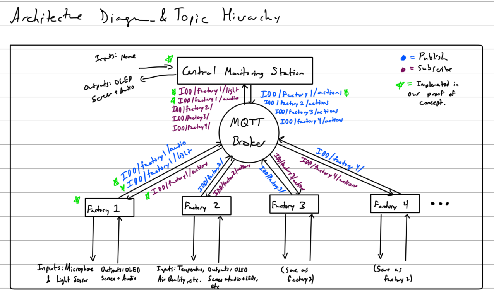

**\*\*\*3. Build a working prototype of the system.\*\*\***

A short video of a behind-the-scenes test is below. The final code for the central monitoring system is [here](./central_monitoring_station.py) and the final code for the factory is [here](./factory.py).

**\*\*\*4. Document the working prototype in use.\*\*\***

A short video of the final interaction is below.

